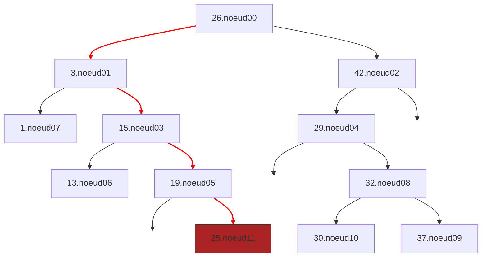



{{ corrige_sujetbac(repere_sujet) }}


{{ corrige_exobac(repere_sujet,1) }}

{{ corrige_exobac(repere_sujet,2) }}

{{ corrige_exobac(repere_sujet,3) }}



1. Etapes de l'insertion du noeud 11 de valeur 25 :

    * A gauche du noeud00 car il a pour valeur 26 et $25<26$

    * A droite du noeud01 car il a pour valeur 3 et $25>3$

    * A droite du noeud03 car il a pour valeur 15  et $25>15$

    * A droite du noeud05 car il a pour valeur 19  et $25>19$

2. A gauche du noeud04, on peut stocker les valeurs strictement inférieures à 29 et supérieures ou égales à 26. C'est à dire : 26,27, et 28.

    !!! note
        Le sujet précise dans son introduction que : 

        > les valeurs du sous-arbre droit sont **supérieures ou égales** à valeur du noeud.

        Avec cette définition, la valeur 26 est donc possible même si elle est déjà présente dans l'arbre. Si on considère que les valeurs sont uniques seules 27 et 28 sont possibles.

3.  &nbsp;

    a. 26, 3, 1, 15, 13, 19, 25, 42, 29, 32, 30, 37

    b.  C'est un parcours préfixé car la valeur du noeud est listé *avant* celle des valeurs présentes dans le sous arbre gauche et le sous arbre droit. La valeur du noeud serait listé *entre* ces valeurs pour un parcours infixe et *après* pour un parcours suffixé.

4.  Afin d'afficher les valeurs par ordre croissant, on doit effectuer un parcours infixe. C'est à dire afficher la valeur du noeud *entre* les valeurs du sous arbre gauche et du sous arbre droit.
```
Parcours2(A): 
    Parcours(A.fils_gauche)
    Afficher(A.valeur)
    Parcours(A.fils_droit)
``` 


{{ corrige_exobac(repere_sujet,4) }}

{{ corrige_exobac(repere_sujet,5) }}