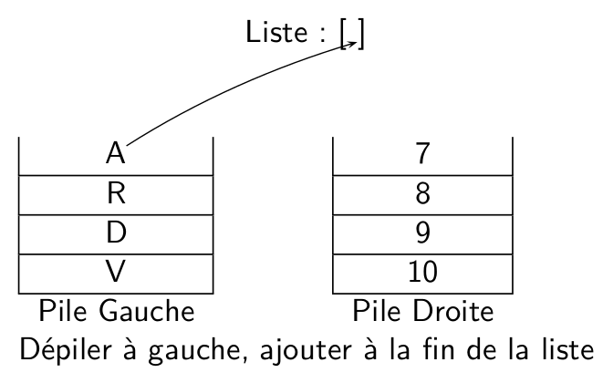




{{ correction_exobac(repere_sujet,numero_exo) }}


1. La pile de gauche va contenir `|'7','8','9','10'>` et celle de droite `|'V','D','R','A'>` (4 premiers éléments de la liste à gauche et 4 derniers à droite). La liste mélange va donc contenir `['10','A','9','R','8','D','7','V']` (on dépile un élément alternativement entre les deux piles).

2. 
```python linenums="1" hl_lines="6 7"
def liste_vers_pile(L):
    '''prend en paramètre une liste et renvoie une pile'''
    N = len(L)
    p_temp = Pile()
    for i in range(N):
        p_temp.empiler(L[i]) #(1)
    return p_temp
```

    1. On utilise la méthode `empiler` de l'interface d'une pile pour ajouter chaque élément de la liste

3. On obtient pour la pile de gauche :<br>
    3  <br>
    2  <br>
    1  <br>
    Et pour celle de droite :<br>
    6<br>
    5<br>
    4<br>

    !!! Bug
        L'énoncé précise que la méthode est `empiler`, la fonction `partage` donnée utilise `empile`.

4.  a. On peut par exemple faire la liste de schémas ci-dessous, en précisant que la fusion se termine lorsque les piles sont vides (l'énoncé garantit que les deux piles ont le même nombre d'éléments)

    {: .imgcentre width=400px}
    {: .imgcentre width=400px}
    {: .imgcentre width=400px}
    {: .imgcentre width=400px}

    b. 
    ```python
        def fusion(p1,p2):
            liste = []
            while note p1.est_vide():
                liste.append(p1.depiler())
                liste.append(p2.depiler())
            return liste
    ```

2. 
```python linenums="1" hl_lines="8"
def affichage(p):
p_temp = p_copier()
if p_temp.est_vide():
        print('----')
    else:
        elt = p_temp.depiler()
        print('|',elt,'|')
        affichage(p_temp) #(1)
```

    1. On relance récursivement l'affichage sur le reste de la pile.

    !!! bug
        Dans le sujet, le `print` de l'avant dernière ligne contient une parenthèse fermante de trop.
