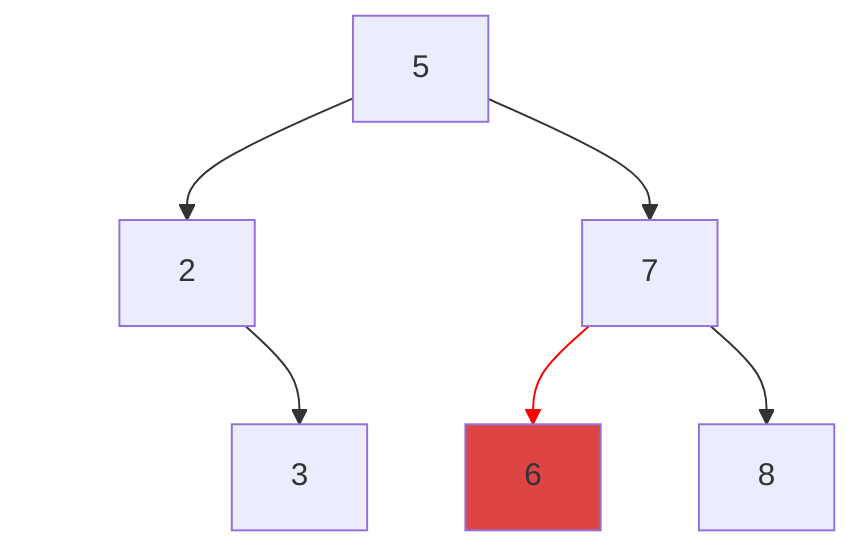




{{ correction_exobac(repere_sujet,numero_exo) }}


### Partie A : Etude d'un exemple

1. Le noeud racine a pour valeur 5, et ses fils sont 2 et 7.
2. Ce sont les noeuds 5,2 et 3.
3. Arbre obtenu après l'ajout de la valeur 6 :


### Partie B : Implémentation en Python

1. La fonction `__init__`  permet  de  créer un objet de type {{sc("abr")}}, par défaut c'est l'arbre binaire vide (`valeur=None`) mais on peut préciser une valeur pour le noeud racine en modifiant ce paramètre.

2. Si on ajoute un élément déjà présent dans l'arbre, alors il ne se passe rien. En effet, dans la méthode `insereElement` le cas `e==self.valeur` n'est pas traité.

3. 
```python linenums="1" hl_lines="1 3 5"
arbre = ABR(5)
arbre.insereElement(2)
arbre.insereElement(3)
arbre.insereElement(7)
arbre.insereElement(8)
```

### Partie C : Tri par arbre binaire de recherche

1. C'est le parcours infixe dans lequel on liste la valeur d'un noeud *entre* les valeurs de sons sous arbre gauche et les valeurs de son sous arbre droit.

2. On sait que les tri par insertion et par sélection ont tous les deux une complexité quadratique. Dans ce nouvel algorithme :
    * l'insertion d'une valeur dans l'arbre a une complexité logarithme (semblable à celle d'une recherche dichotomique)
    * donc l'insertion des $n$ valeurs a une complexité  en $\mathcal{O}(n\log(n))$
    * Une fois les insertions effectuées le parcours a une complexité linéaire
La complexité de ce nouvel algorithme est donc en $\mathcal{O}(n\log(n))$ (parfois appelé complexité pseudo linéaire) et est donc meilleur que la complexité quadratique des tris par selection ou par insertion.