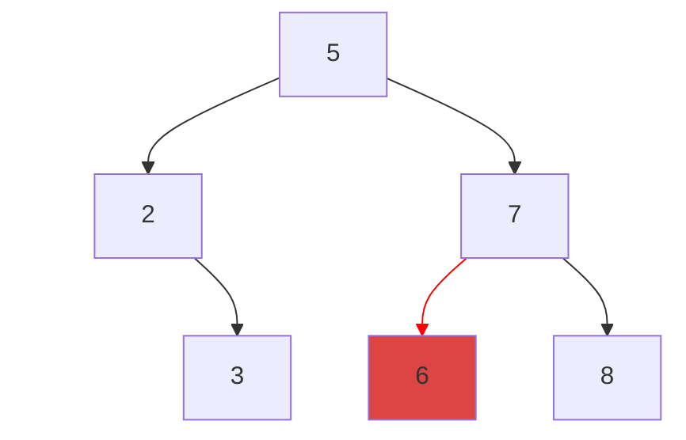



{{ corrige_sujetbac(repere_sujet) }}


{{ corrige_exobac(repere_sujet,1) }}


### Partie A

1. Les affichages obtenues seront :
    * `8` car `len(notes)` est le nombre d'éléments de la liste `notes`
    * `[8,7,18,16,12,9,17,3]` car on affiche la liste de départ en ayant remplacé la valeur située à l'indice 3 par 16.

2. Pour afficher les éléments d'indice 2 à 4 de la liste on peut écrire :
```python
for i in range(2,5):
    print(note[i])
```

    !!! note
        L'utilisation d'une boucle ne s'impose pas, on aurait pu écrire `print(note[2],note[3],note[4])` ou encore utiliser les *slices* : `print(note[2:5])` (bien qui cette solution affiche une *liste* composée des trois éléments demandés)

### Partie B

1. Code complété :
```python linenums="1" hl_lines="6 7"
def tri_insertion(liste):
    """ trie par insertion la liste en paramètre """
    for indice_courant in range(1,len(liste)):
        element_a_inserer = liste[indice_courant]
        i = indice_courant - 1
        while i >= 0 and liste[i] > element_a_inserer :
            liste[i+1] = liste[i]
            i = i - 1
        liste[i + 1] = element_a_inserer
```

2. Après le premier passage : `[7, 8, 18, 14, 12, 9, 17, 3]`

3. Après le troisième passage : `[7, 8, 14, 18, 12, 9, 17, 3]`

    !!! note
        On rappelle que le principe de l'algorithme est d'insérer au passage $n$ le n-ième élément de la liste dans le début de la liste (déjà triée).

### Partie C 

1. Cet algorithme est itératif car un tri fusion fait appel lui-même 
2. Si les deux tas sont déjà triés, il suffit de comparer les cartes situés  sur le dessus de chaque tas et de prendre la plus petite.
3. Code complété :
```python linenums="1" hl_lines="7 8 9"
from math import floor

def tri_fusion (liste, i_debut, i_fin):
    """ trie par fusion la liste en paramètre depuis 4 i_debut jusqu’à i_fin """
    if i_debut < i_fin:
        i_partage = floor((i_debut + i_fin) / 2)
        tri_fusion(liste, i_debut, i_partage )
        tri_fusion(liste, i_partage+1 , i_fin)
        fusionner(liste, i_debut , i_partage , i_fin)
```

    !!! note
        L'utilisation de la fonction `floor` ne s'impose pas, puisque'on travaille sur des entiers  `i_partage` se définit sans recours à la bibliothèque `math` avec `i_partage = (i_debut+i_fin)//2`.

4. Cette ligne permet d'importer la méthode `floor` à partir du module `math`.

### Partie D

1. C'est l'algorithme du tri fusion qui a été utilisée. Chaque étape représente la fusion de  listes déjà triées.

2. Le tri par insertion a une complexité en $\mathcal{O}(n)$ dans le pire des cas et le tri fusion une complexité en $\mathcal{O}(n\,\log_2(n))$.

3. Dans un tri par insertion, on effectue un maximum de `n` insertions demandant chacune au plus `n` opérations. Cette algorithme a donc une complexité quadratique. Pour le tri fusion, on note $C(n)$ le coût en nombre d'opérations pour trier une liste de taille $n$. Pour trier une liste de taille $n$, séparer les deux listes (coût de $n$ opérations), trier deux listes de taille $\dfrac{n}{2}$ et les fusionner (coût de $n$ opérations). Donc $C(n) = 2\,C(\dfrac{n}{2}) + 2n$, on montre que cela implique un coût en $\mathcal{O}(n\,\log_2(n))$.

    !!! attention
        Question difficile et à la limite du programme de {{sc("nsi")}} qui par ailleurs parle de *coût* plutôt que de *complexité*.

{{ corrige_exobac(repere_sujet,2) }}

{{ corrige_exobac(repere_sujet,3) }}


### Partie A : Etude d'un exemple

1. Le noeud racine a pour valeur 5, et ses fils sont 2 et 7.
2. Ce sont les noeuds 5,2 et 3.
3. Arbre obtenu après l'ajout de la valeur 6 :


### Partie B : Implémentation en Python

1. La fonction `__init__`  permet  de  créer un objet de type {{sc("abr")}}, par défaut c'est l'arbre binaire vide (`valeur=None`) mais on peut préciser une valeur pour le noeud racine en modifiant ce paramètre.

2. Si on ajoute un élément déjà présent dans l'arbre, alors il ne se passe rien. En effet, dans la méthode `insereElement` le cas `e==self.valeur` n'est pas traité.

3. 
```python linenums="1" hl_lines="1 3 5"
arbre = ABR(5)
arbre.insereElement(2)
arbre.insereElement(3)
arbre.insereElement(7)
arbre.insereElement(8)
```

### Partie C : Tri par arbre binaire de recherche

1. C'est le parcours infixe dans lequel on liste la valeur d'un noeud *entre* les valeurs de sons sous arbre gauche et les valeurs de son sous arbre droit.

2. On sait que les tri par insertion et par sélection ont tous les deux une complexité quadratique. Dans ce nouvel algorithme :
    * l'insertion d'une valeur dans l'arbre a une complexité logarithme (semblable à celle d'une recherche dichotomique)
    * donc l'insertion des $n$ valeurs a une complexité  en $\mathcal{O}(n\log(n))$
    * Une fois les insertions effectuées le parcours a une complexité linéaire
La complexité de ce nouvel algorithme est donc en $\mathcal{O}(n\log(n))$ (parfois appelé complexité pseudo linéaire) et est donc meilleur que la complexité quadratique des tris par selection ou par insertion.

{{ corrige_exobac(repere_sujet,4) }}

{{ corrige_exobac(repere_sujet,5) }}
