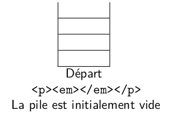
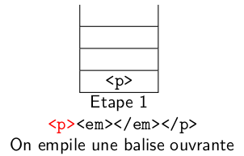
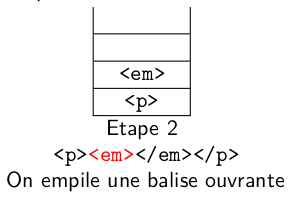
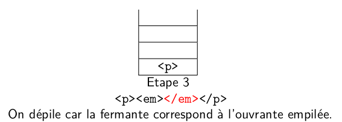
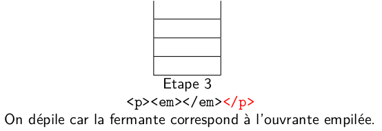
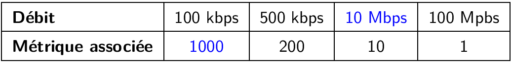



{{ corrige_sujetbac(repere_sujet) }}


{{ corrige_exobac(repere_sujet,1) }}

**Partie A**

1. Cette phrase décrit le comportement d'une file. En effet, dans une file, le premier élément entré est aussi le premier sorti. Dans une pile par contre le premier entré sera le dernier à sortir.

2. La variable `controleur` augmente de 1 lorsqu'on rencontre une parenthèse ouvrante et diminue de 1 lorsqu'on rencontre une parenthèse fermante par conséquent :

    * pour `B=((()()` les valeurs successives seront : $1, 2, 3, 2, 3, 2$
    * pour `C=(()))(` les valeurs successives seront : $1, 2, 1, 0, -1, 0$

3. Le test 1 : 
```python
if controleur < 0
```
L'exemple de l'expression `C` illustre ce cas de figure, l'expression est mal parenthésée car le controleur devient négatif

    Le test 2 :
```python
if controleur == 0
```
L'exemple de l'expression `B` illustre ce cas de figure, l'expression est mal parenthésée car le controleur est non nul après avoir parcouru toute l'expression

    !!! Attention
        Dans les 4 dernières lignes du code proposé dans l'exercice, on teste si un booléen est vrai et dans ce cas on renvoie vrai et faux sinon :
        ```python
        if controleur == 0 : # 
            return True #le parenthésage est correct
        else:
            return False #parenthèse(s) fermante(s) manquante(s)
        ```
        Ce qui revient à renvoyer ce booléen, ces quatre lignes se résument donc :
        ```python
        return controleur == 0
        ```
**Partie B**<br>
4. a. 

{.imgcentre}

{.imgcentre}

{.imgcentre}

{.imgcentre}

{.imgcentre}


b. Si la pile est vide en fin de parcours alors le balisage est correct.

c. Puisque l'expression est correctement balisée, il y autant de balises ouvrantes que de balises fermantes (6 de chaque). Puisqu'on empile les balises ouvrantes, la pile contiendra au maximum 6 éléments.

{{ corrige_exobac(repere_sujet,2) }}


1. a. Cette requête renvoie les champs `nom`, `prenom` et `naissance` de la relation `individu` lorsque le nom est `'Crog'`. Sur l'extrait de la table, on obtient donc : `'Crog', 'Daniel', '07-07-1968'`.

    !!! Attention
        Le sujet présente des *extraits* des relations `individu` et `realisation`, on ne sait pas s'il faut fournir le résultat des requêtes sur ces extraits uniquement ou de façon générale. Dans la réponse précédente, on donne les deux.
    b. 
    ```sql
    SELECT titre, id_rea FROM realisation WHERE annee > 2020;
    ```

2. a. C'est la requête 1 qu'il faut utiliser, elle met à jour la table. La requête 2 ne fonctionne pas car elle insère un nouvel enregistrement, or `id_ind` est une clé primaire donc unique.  On ne peut donc pas insérer un nouvel enregistrement ayant pour `id_int` la valeur `688`.

    b. Pour la relation `individu` la clé primaire est `id_ind` les autres valeurs acceptent donc des doublons (pas de contrainte `UNIQUE`) et on peut donc avoir deux individus ayant même nom, prénom et date de naissance.

3.  a.
    ```sql hl_lines="2"
    INSERT INTO emploi
    VALUES (5400, 'Acteur(James Bond)', 688, 105); -- (1)
    ```
    1. `688` est l'`id_ind` de Daniel Crog et 105 l'`id_rea` de "Casino Imperial".

    ```sql hl_lines="2"
    INSERT INTO emploi
    VALUES (5401, 'Acteur(James Bond)', 688, 325); -- (1)
    ```

    1. `688` est l'`id_ind` de Daniel Crog et 325 l'`id_rea` de "Ciel tombant".

    b. On doit d'abord créer l'enregistrement du film dans la relation `realisation`, car `id_rea` étant une clé étrangère de la relation `emploi`, on ne peut pas créer un enregistrement dans `emploi` si son `id_rea` ne figure pas dans `realisation`.

4.  a. 
    ```sql
    SELECT individu.nom, realisation.titre, realisation.annee
    FROM emploi
    JOIN individu ON individu.id_ind = emploi.id_ind
    JOIN realisation ON realisation.id_rea = emploi.id_rea
    WHERE emploi.description = 'Acteur(James Bond)';
    ```

    b.
    ```sql
    SELECT emploi.description
    FROM emploi
    JOIN individu ON individu.id_ind = emploi.id_ind
    WHERE individu.prenom = "Denis" and individu.nom = "Johnson"
    ```

{{ corrige_exobac(repere_sujet,3) }}

1.  a. <br>
    {{binaire("11000000")}} $= 128 + 64 = 192$<br>
    {{binaire("10101000")}} $= 128 + 32 + 8 = 168$<br>
    {{binaire("10000000")}} $= 128$<br> 
    {{binaire("10000011")}} $= 128 + 2 + 1 = 131$<br>
    L'écriture décimale de cette adresse {{sc("ip")}}v4 est donc  $192.168.128.131$
    b. Le dernier octet a 256 valeurs possibles (de 0 à 255), le nombre d'adresses différentes possibles du réseau A est donc 256.

    !!! Attention
        Deux adresses sont réservées dans un réseau : une pour le réseau lui-même  et l'autre pour la diffusion  (*broadcast*). Donc parmi les 256 possibilités,  254 peuvent être attribuées à un hôte du réseau.

2.  a. Le routeur A est directement relié à B, C et D (métrique 1)

    b. 
        ```mermaid
        graph LR
        A(("A"))
        B(("B"))
        C(("C"))
        D(("D"))
        E(("E"))
        A --- B & C & D
        B --- D
        C --- D
        D --- E
        ```

3. 
{.imgcentre width=500px}

4.  a. Le chemin emprunté sera F - H - J - K - I pour un coût de 13. Les autres chemins ont un coût supérieur et dans le protocole {{sc("ospf")}} on minimise le coût (et pas le nombre de routeurs traversés comme dans le protocole {{sc("rip")}})

    b.

    |Destination|Métrique|
    |-----------|--------|
    | F         | 0      |
    | G         | 8      |
    | H         | 5      |
    | I         | **13** |
    | J         | **6**  |
    | K         | **8**  |
    | L         | **11** |

    c. Une panne du routeur H, en effet dans ce cas :

    * pour transmettre de I à F le chemin serait I - K - J - **G** - F (coût minimal de 19),
    * pour transmettre de K à F le chemin serait K - J - **G** - F (coût minimal de 14),
    * pour transmettre de J à F le chemin serait J - **G** - F (coût minimal de 12)
    * pour transmettre de L à F le chemin serait L - **G** - F (coût minimal de 20)

    Dans tous les cas, on transite bien par **G**.

{{ corrige_exobac(repere_sujet,4) }}

**Partie A : Parcours d'un arbre**

1. La somme de l'arbre précédent est $32$ : $3+6+2+7+4+9+1$


2. Les réponses sont regroupées dans le tableau ci-dessous :

    | Lettre | Noms |
    |--------|------|
    | **A**  | Racine|
    | **B**  | Noeud|
    | **C**  | Feuille|
    | **D**  | {{sc("sag")}}|
    | **E**  | {{sc("sad")}}|  

3. Le parcours en largeur correspond au parcours de haut en bas et de gauche en droite c'est à dire à la **proposition C** : 3-6-2-7-4-9-1

4. 
```python
def somme(nombres):
    s = 0
    for n in nombres:
        s += n
    return s
```

    !!! Remarques
        On peut aussi penser à utiliser `sum`


5. C'est un parcours en largeur, en effet les noeuds sont placés dans une file, ils sont donc traités dans leur ordre d'arrivée.

**Partie B : Méthode 'diviser pour régner'**

6. C'est la proposition D : *diviser un problème en deux problèmes plus petits et indépendants.*

    !!! Attention
        * on peut diviser en plus de *deux* sous problèmes
        * la méthode inclus normalement une phase où on combine les solutions des sous problèmes afin d'obtenir celle du problème initial.

7. somme(Arbre) = valeur de la racine + somme(SAG) + somme(SAD)

8. 
```python
def calcul_somme(arbre):
    if est_vide(arbre):
        return 0
    else:
        return valeur_racine(arbre) + somme(arbre_gauche(arbre)) + somme(arbre_droit(arbre))
```

{{ corrige_exobac(repere_sujet,5) }}


1. C'est l'**instruction 3** : `joueur1 = Joueur("Sniper",319,"A")`

2.  a.
    ```python
    def redevenir_actif(self):
        if not self.est_actif:
            self.est_actif = True
    ```

    b.
    ```python
    def nb_de_tirs_recus(self):
        return len(liste_id_tirs_recus)
    ```

3.  a. C'est le **test 1** qui vérifie que l'équipe du participant est bien celle de la base.

    b. A la ligne 5, on constate que lorsqu'un joueur a été touché par le tir d'un coéquipier, le score de l'équipe diminue de 20.

4. 
```python
if participant.est_determine(): # (1)
    self.incremente_score(40) 
```

    1. Dans la classe `Joueur` donnée en début d'exercice on trouve la méthode `est_determine`
