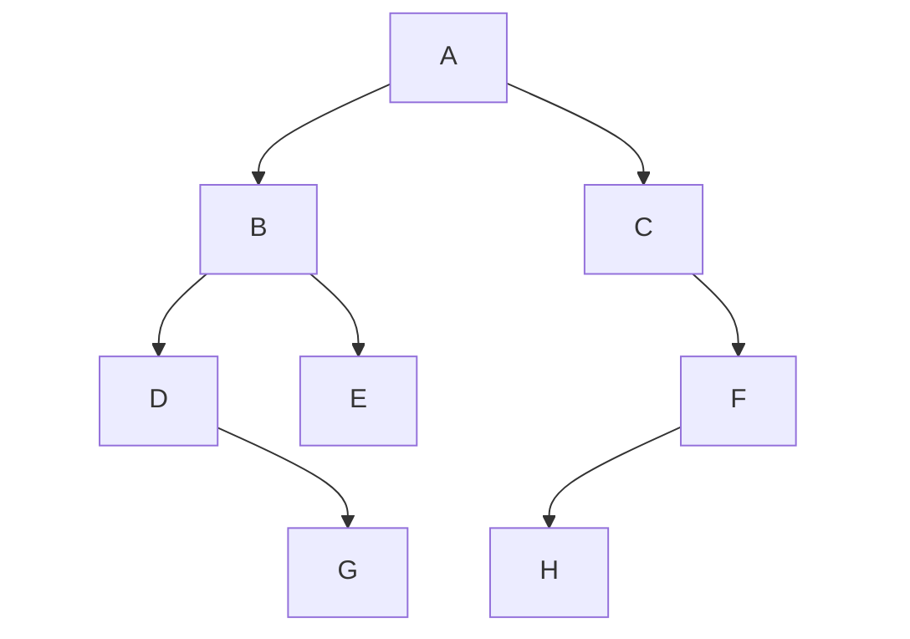
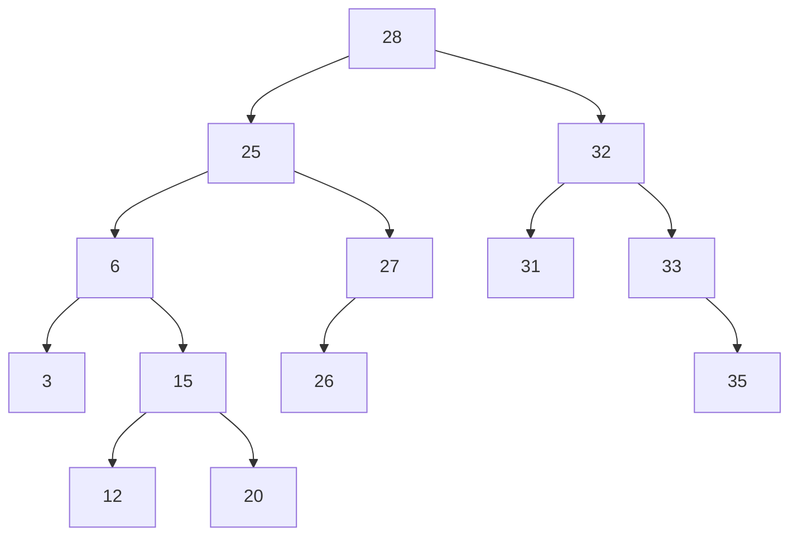
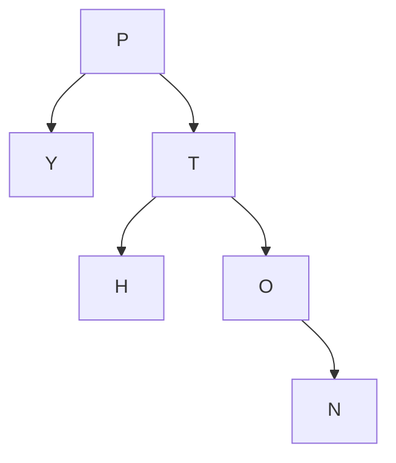
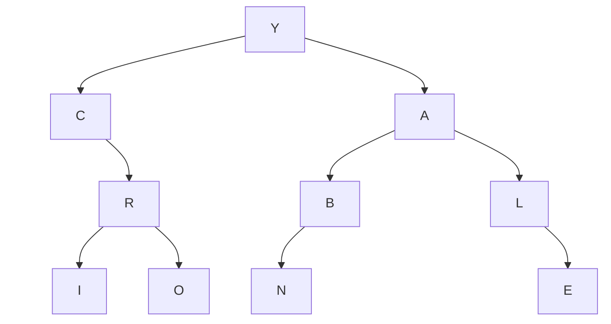
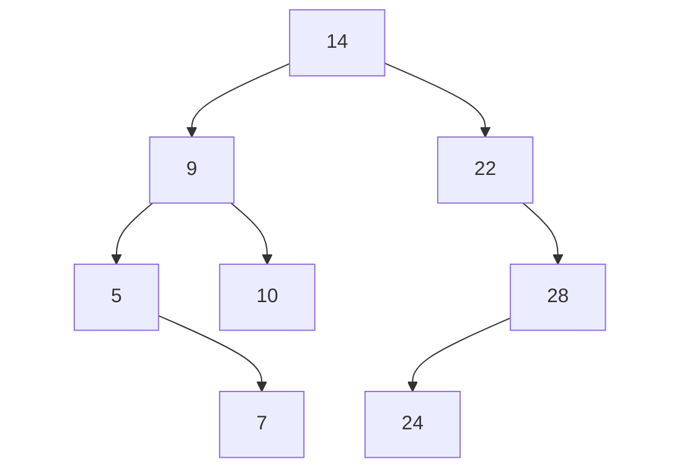
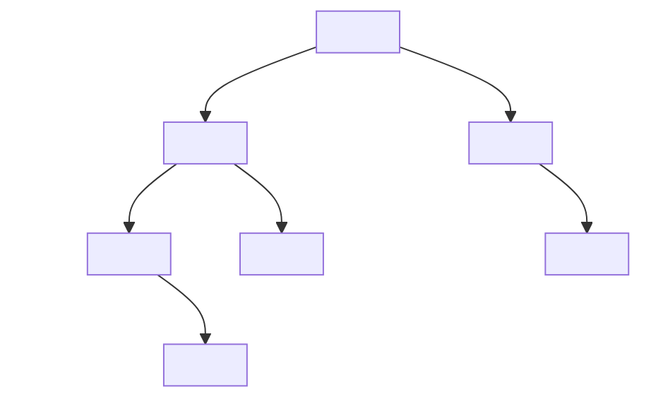




{{ titre_chapitre(num,titre,theme)}}
 
## Activités 

{{ titre_activite("Parcourir un arbre",[],0) }}

1. Rappel sur l'implémentation utilisée: 

    1. Récupérer et enregistrer l'implémentation des arbres binaires vu au [chapitre 8](https://fabricenativel.github.io/NSITerminale/arbres/){target=_blank} :
    {{ telecharger("Implémentation arbres binaires","./files/C8/ab.py")}}

    2. Utiliser cette implémentation pour définir et afficher l'arbre binaire ci-dessous :
    <div class="centre">

</div>
    3. Quelle est la taille de cet arbre ? Vérifier que la méthode `taille` de l'implémentation renvoie le résultat correct.
    4. Quelle est la hauteur de cet arbre ? Vérifier que la méthode ` hauteur` de l'implémentation renvoie le résultat correct.

    Le but cette activité est de découvrir (et d'implémenter) quatre algorithmes  de parcours d'un arbre qui donneront les noeuds dans un ordre différent :

    * Le parcours en largeur
    * Le parcours en profondeur préfixé
    * Le parcours en profondeur infixé
    * Le parcours en profondeur suffixé

2. Le parcours en largeur

    1. Selon vous, quel sera l'ordre des noeuds dans un parcours en *largeur* sur l'arbre ci-dessous ?
    2. D'un point de vue algorithmique quel est le procédé utilisé pour obtenir cet ordre ?
    3. Pour implémenter ce parcours, on propose la méthode ci-dessous, la compléter et la recopier dans l'implémentation des arbres binaires :
    ```python
    def parcours_largeur(self):
            # Ordre de traitement : noeud, fils gauche, le fils droit
            a_traiter = [.........]
            pl = []
            while len(a_traiter)!=0:
                noeud_courant=a_traiter[0]
                pl.append(..............)
                # Si le noeud a un fils gauche l'ajouter à ceux à traiter
                if noeud_courant.gauche!=.....:
                    a_traiter........(.................)
                # De même s'il a un fils droit
                if .............:
                    a_traiter........(.................)
                a_traiter.pop(.)
            return pl
    ```

    4. Tester cette méthode sur l'arbre définie dans la première partie.
    5. Cette méthode fonctionne-t-elle pour l'arbre vide ? Sinon la corriger.
    6. Reconnaître la structure de donnée utilisée pour les noeuds à traiter (variable `a_traiter`). Est-il judicieux d'utiliser une liste pour cette structure de données ?

3. Le parcours en profondeur  
Dans un parcours en profondeur on s'appuie sur la définition récursive des arbres. Pour parcourir un arbre $T=(r,sag,sad)$ on va donc parcourir $sag$ et $sad$. On comprend alors qu'on a trois possibilité :

    * Lister l'étiquette  $r$ avant de parcourir $sag$ et $sad$, c'est le parcours prefixé.
    * Lister l'étiquette $r$ après le parcours de  $sag$ mais avant celui de $sad$, c'est le parcours infixé.
    * Lister l'étiquette $r$ après le parcours de $sag$ et de $sad$, c'est le parcours suffixé.


        1. Quel sera l'ordre des noeuds pour chacun de ces trois parcours sur l'arbre de la première partie ?
        2. Ecrire une implémentation du parcours préfixé.

            !!!aide 
                 Traduire en méthode récursive que le parcours de $T=(r,sag,sad)$ est $r$ + le parcours de $sag$ + le parcours de $sad$

        3. Ecrire une implémentation du parcours infixé 
        4. Ecrire une implémentation du parcours suffixé.

{{ titre_activite("Arbre binaire de recherche",[]) }}

On considère l'arbre binaire suivant noté $T$ et dont les étiquettes sont des nombres entiers. 
<div class="centre">

</div>

1. Propriété des arbres binaires de recherche

    1. On considère la racine de cette arbre. Ecrire son étiquette puis lister toutes les étiquettes de son sous arbre gauche et toutes les étiquettes de son sous arbre droit. Que remarquez-vous ?
    2. Pour un autre noeud quelconque de cet arbre, donner son étiquette puis toutes les étiquettes de son sous arbre gauche et toutes les étiquettes de son sous arbre droit. Que remarquez-vous ?
    3. L'arbre binaire précédent est un arbre binaire de *recherche*. Proposer une définition des arbres binaire de recherche en vous basant sur la propriété observée ci-dessus.

        !!!note 
            Par souci de simplicité on considère par la suite que toutes les étiquettes d'un arbre binaire de recherche (noté {{sc("abr")}}) sont *uniques*. Ainsi dans l'arbre précédent un entier donné ne peut pas apparaître deux fois.

    2. Dessiner tous les {{sc("abr")}} ayant 3 noeuds et contenant les nombres 1, 2 et 3.
    3. Dessiner un {{sc("abr")}} dégénéré de hauteur 5 et contenant les nombres 1,2,3,4 et 5.
    4. Dessiner un {{sc("abr")}} complet de taille 7 et contenant les nombres 1,2,3,4,5,6 et 7.

2. Recherche d'un élément dans un arbre binaire de recherche

    1. On cherche à savoir si la valeur 18 est présente dans l'arbre $T$. L'arbre entier doit-il être exploré ? Justifier.
    2. Quel chemin faut-il explorer dans $T$ pour rechercher la valeur 15 (surligner en rouge).
    3. Même question pour 37 (surligner en bleu).
    4. Proposer un algorithme permettant de rechercher une valeur dans un arbre binaire de recherche.

        !!!aide 
            Penser récursif !

    5. Que peut-on dire de la complexité de cet algorithme ?

        !!!aide 
            On pourra s'appuyer sur les cas extrêmes (arbre complet ou arbre dégénéré) et faire le lien avec la recherche dans une liste ou la recherche dichotomique dans une liste triée. D'autre part on pourra remarquer qu'à chaque étape de la recherche on descend d'un niveau dans l'arbre.

3. Insertion d'un élément dans un arbre binaire de recherche

    1. A quelle position faut-il insérer le noeud d'étiquette 4 dans $T$ pour qu'il conserve sa propriété ?
    2. Même question pour le noeud d'étiquette 30.
    3. Proposer un algorithme permettant d'insérer une valeur dans un arbre binaire de recherche.
    
        !!!aide 
            Comme ci-dessus, penser à utiliser la récursivité. D'autre part on rappelle qu'on a supposé que les étiquettes sont uniques, par conséquent, on renverra une erreur dans le cas où la valeur à insérer existe déjà dans l'arbre.


## Cours

{{ aff_cours(num) }}


## Exercices

{{ exo("Parcours d'arbre",[],0) }}
<div class="centre">

</div>

1. Quel sera l'ordre des noeuds lors du parcours de l'arbre ci-dessus :

    1. lors d'un parcours en largeur,
    2. lors d'un parcours en profondeur prefixe,
    3. lors d'un parcours en profondeur infixe,
    4. lors d'un parcours en profondeur suffixe.

2. Vérifier vos réponses à la question précédente en utilisant les fonctions de parcours définies sur l'implémentation des arbres binaires vue en cours.

3. Mêmes questions avec l'arbre binaire suivant :
<div class="centre">

</div>

{{ exo("Arbre binaire de recherche",[])}}
<div class="centre">

</div>

1. Prouver que cet arbre est un arbre binaire de recherche.
2. Dessiner l'arbre obtenu après insertion de la valeur `11` dans cet abre.

{{ exo("Dessiner un arbre binaire de recherche",[])}}

1. Dessiner un arbre binaire de recherche *complet*, contenant les valeurs suivantes : 2,7,10,15,19,24,25.
2. Dessiner un arbre binaire de recherche *dégénéré* contenant ces sept même valeurs.
3. Même question lorsque l'arbre à la structure suivante :



{{ exo("Implémentation des arbres binaires de recherche",[])}}

1. Récupérer et enregistrer l'implémentation des arbres binaires de recherche ci-dessous :
    {{ telecharger("Implémentation arbres binaires de recherche","./files/C10/abr.py")}}
2. Compléter puis tester la méthode `appartient` ci-dessous qui permet de tester avec cette implémentation si un élément se trouve ou non dans un arbre binaire de recherche 
```python
    def appartient(self,valeur):
        # Si l'arbre est vide, la valeur ne s'y trouve pas
        if self.racine==None:
            return False
        else:
        # Sinon on compare avec l'étiquette de la racine
            if int(self.racine.etiquette)==valeur:
                return ........
            if valeur<int(self.racine.etiquette):
                # Création du sous arbre gauche
                sag = ArbreBinaire(.............)
                return ..........
            sad = ArbreBinaire(..............)
            return .................
```
3. Ecrire une méthode `insere` qui permet d'insérer une valeur dans un arbre binaire de recherche.

{{ exo("Amérique du nord 2021- Exercice 4",["bac"]) }}

{{telecharger("Enoncé","./pdf/C10/AmeriqueNord2021ex4.pdf")}}


{{ exo("Métropole 2021 CL Sujet 2 - Exercice 3",["bac"]) }}

{{telecharger("Enoncé","./pdf/C10/Metropole2021CL-Sujet2-ex3.pdf")}}

{{ exo("Métropole 2021  Sujet 1 - Exercice 1",["bac"]) }}

{{telecharger("Enoncé","./pdf/C10/Metropole2021-Sujet2-ex1.pdf")}}

{{ exo("Etranger 2021  Sujet 1 - Exercice 3",["bac"]) }}

{{telecharger("Enoncé","./pdf/C10/Etranger2021-Sujet1-ex3.pdf")}}

