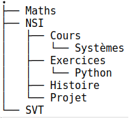




{{ titre_chapitre(num,titre,theme)}}
 
## Activités 

{{ titre_activite("Vocabulaire",[],0) }}

1. Après execution d'une commande dans un terminal Linux on a obtenu l'affichage ci-dessous :
{: .centre}

    1. De quelle commande s'agissait-il ? Quelle est sa traduction en français ?
    2. Que sont `Maths` et `NSI` pour le système d'exploitation ?
    3. Un point (**.**) figure en haut du schéma, quelle en est la signification ?
    4. Que signifie le lien entre `NSI` et `Projet` ?

2. Le schéma ci-dessus est un exemple d'**arbre** (on parle d'ailleurs de l'arborescence des dossiers dans un système d'exploitation). Un arbre est constitué de **noeuds** et un lien entre deux noeuds s'appelle une **arête**.

    1. Citer trois noeuds de l'arbre ci-dessus et donner un exemple d'arête.
    2. Quel noeud est le répertoire parent de `Systèmes`  ? On dira dans le vocabulaire des arbres que le noeud `Systèmes` est un **fils** de ce noeud.
    3. Citer tous les fils du noeud `NSI`.
    4. Dans un arbre, un seul et unique noeud n'est le fils de personne, on l'appelle la **racine** de l'arbre. De qui s'agit-il ici ?
    5. Nommer les noeuds n'ayant aucun fils (on les appelle **feuilles** de l'arbre).
    6. Une **branche** est une suite (finie) de noeuds depuis la racine vers une feuille. Donner une branche de cette arbre constituée de trois noeuds.
    7. Donner la **taille** de cet arbre (c'est à dire son nombre de noeuds).
    8. Donner l'**arité** de cet arbre, c'est à dire le nombre maximal de fils qu'un noeud peut avoir.
    9. Donner la **hauteur** de cet arbre c'est à dire le nombre maximal de noeuds dans une branche.

        !!! Attention
                La hauteur d'un arbre est parfois définie comme le plus grand nombre d'arêtes dans une branche. Dans les sujets de d'examens de NSI, la définition utilisée est rappelée en début d'exercice.

## Cours

{{ aff_cours(num) }}

## Exercices

