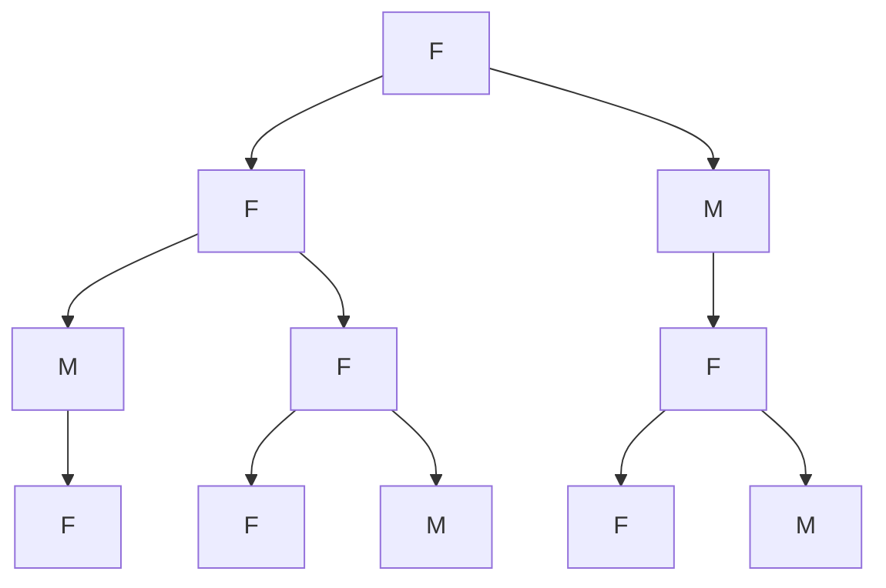
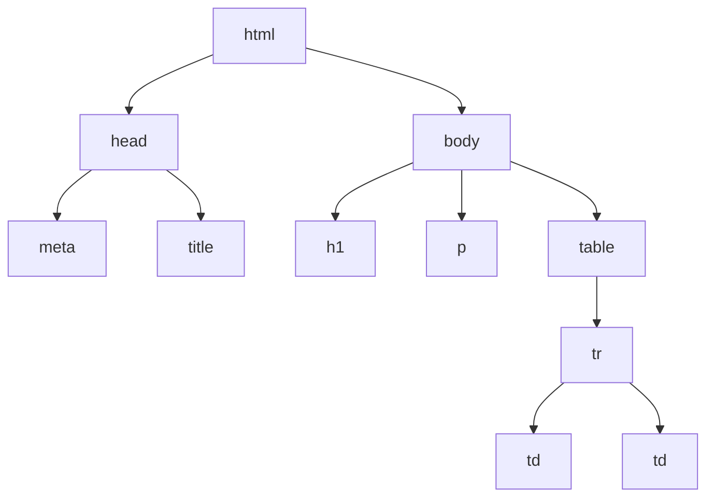




{{ titre_chapitre(num,titre,theme)}}
 
## Activités 

{{ titre_activite("Vocabulaire",[],0) }}

1. Après execution d'une commande dans un terminal Linux on a obtenu l'affichage ci-dessous :
{: .centre}

    1. De quelle commande s'agissait-il ? Quelle est sa traduction en français ?
    2. Que sont `Maths` et `NSI` pour le système d'exploitation ?
    3. Un point (**.**) figure en haut du schéma, quelle en est la signification ?
    4. Que signifie le lien entre `NSI` et `Projet` ?

2. Le schéma ci-dessus est un exemple d'**arbre** (on parle d'ailleurs de l'arborescence des dossiers dans un système d'exploitation). Un arbre est constitué de **noeuds** et un lien entre deux noeuds s'appelle une **arête**.

    1. Citer trois noeuds de l'arbre ci-dessus et donner un exemple d'arête.
    2. Quel noeud est le répertoire parent de `Systèmes`  ? On dira dans le vocabulaire des arbres que le noeud `Systèmes` est un **fils** de ce noeud.
    3. Citer tous les fils du noeud `NSI`.
    4. Dans un arbre, un seul et unique noeud n'est le fils de personne, on l'appelle la **racine** de l'arbre. De qui s'agit-il ici ?
    5. Nommer les noeuds n'ayant aucun fils (on les appelle **feuilles** de l'arbre).
    6. Une **branche** est une suite (finie) de noeuds depuis la racine vers une feuille. Donner une branche de cette arbre constituée de trois noeuds.
    7. Donner la **taille** de cet arbre (c'est à dire son nombre de noeuds).
    8. Donner l'**arité** de cet arbre, c'est à dire le nombre maximal de fils qu'un noeud peut avoir.
    9. Donner la **hauteur** de cet arbre c'est à dire le nombre maximal de noeuds dans une branche.

        !!! Attention
                La hauteur d'un arbre est parfois définie comme le plus grand nombre d'arêtes dans une branche. Dans les sujets de d'examens de NSI, la définition utilisée est rappelée en début d'exercice.

{{ titre_activite("Arbre binaire",[])}}

Chez les abeilles, le système de reproduction fait que :

* une abeille femelle est issue de deux abeilles, un mâle et une femelle,
* une abeille mâle est issue d'une seule abeille femelle.


Cela s'explique par le fait qu'un oeuf non fécondé (donc issu uniquement d'une femelle) donne toujours naissance à une abeille mâle, alors qu'une oeuf fécondé (donc issu d'un mâle et d'une femelle) donne toujours naissance à une abeille femelle. On a représenté ci-contre les quatre premiers niveaux de l'arbre généalogique d'une abeille mâle en notant avec la lettre **M** les mâles et la lettre **F** les femelles.



1. Définition des arbres binaires  

    1. Recopier et compléter cet arbre en ajoutant le 5^e^ niveau.
    2. Rappeler la définition de l'*arité* d'un arbre et d'un noeud. Quelle est l'arité des feuilles d'un arbre ?
    3. Déterminer le degré (arité) des noeuds qui ne sont pas des feuilles selon que le noeud représente une abeille male ou une abeille femelle.
    4. On appelle **arbre binaire**, un arbre dans lequel les noeuds ont au maximum deux fils. Donner une définition équivalente utilisant le mot *arité* et justifier rapidement que l'arbre généalogique d'une abeille est binaire.

2. Une définition récursive
On reprend l'exemple de l'abre généalogique d'une abeille femelle jusqu'au cinquième niveau dessinée ci-dessus. On appelle *sous arbre gauche* et *sous arbre droit* l'arbre généalogique de chacune des deux parents de la racine. L'arbre est alors noté sous la forme d'un triplet constitué de la racine et des deux sous arbres : `(racine, sous arbre gauche, sous arbre droit)`. 

    1. Justifier rapidement que les deux sous arbres sont des arbres binaires.
    2. Que dire du sous arbre droit lorsque l'abeille est un mâle ?
    3. Pour une feuille, que dire du sous arbre droit et du sous arbre gauche ?
    4. En déduire une version récursive de la définition d'un arbre binaire.
    5. Donner une définition récursive de la taille d'un arbre binaire.
    6. Donner une définition récursive de la hauteur d'un arbre binaire.


## Cours

{{ aff_cours(num) }}


## Exercices

{{ exo("DOM",[],0) }}
On considère le code  {{sc("html")}} suivant :
```html
<html lang="fr">
<head>
    <meta charset="UTF-8">
    <title>Exemple</title>
</head>
<body>
    <h1> Un titre </h1>
    <p> Bonjour ! </p>
    <table>
        <tr>
            <td> Case 1</td>
            <td> Case 2</td>
        </tr>
    </table>
</body>
</html>
```
Ce document peut se représenter par un arbre :


1. Que représentent les noeuds de cet arbre ?
2. Que signifie du point de vue du {{sc("html")}} une arête de cet arbre ?
3. Quelle est la racine de cet arbre ?
4. Donner les feuilles de cet arbre.
5. Donner une branche de cet arbre.
6. Donner l'arité de cet arbre.
7. Donner la hauteur de cet arbre.

