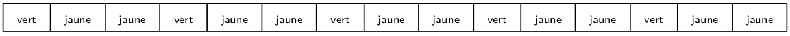



{{ corrige_sujetbac(repere_sujet) }}


{{ corrige_exobac(repere_sujet,1) }}


1. La pile de gauche va contenir `|'7','8','9','10'>` et celle de droite `|'V','D','R','A'>` (4 premiers éléments de la liste à gauche et 4 derniers à droite). La liste mélange va donc contenir `['10','A','9','R','8','D','7','V']` (on dépile un élément alternativement entre les deux piles).

2. 
```python linenums="1" hl_lines="6 7"
def liste_vers_pile(L):
    '''prend en paramètre une liste et renvoie une pile'''
    N = len(L)
    p_temp = Pile()
    for i in range(N):
        p_temp.empiler(L[i]) #(1)
    return p_temp
```

    1. On utilise la méthode `empiler` de l'interface d'une pile pour ajouter chaque élément de la liste

3. On obtient pour la pile de gauche :<br>
    3  <br>
    2  <br>
    1  <br>
    Et pour celle de droite :<br>
    6<br>
    5<br>
    4<br>

    !!! Bug
        L'énoncé précise que la méthode est `empiler`, la fonction `partage` donnée utilise `empile`.

4.  a. On peut par exemple faire la liste de schémas ci-dessous, en précisant que la fusion se termine lorsque les piles sont vides (l'énoncé garantit que les deux piles ont le même nombre d'éléments)

    {: .imgcentre width=400px}
    {: .imgcentre width=400px}
    {: .imgcentre width=400px}
    {: .imgcentre width=400px}

    b. 
    ```python
        def fusion(p1,p2):
            liste = []
            while note p1.est_vide():
                liste.append(p1.depiler())
                liste.append(p2.depiler())
            return liste
    ```

2. 
```python linenums="1" hl_lines="8"
def affichage(p):
p_temp = p_copier()
if p_temp.est_vide():
        print('----')
    else:
        elt = p_temp.depiler()
        print('|',elt,'|')
        affichage(p_temp) #(1)
```

    1. On relance récursivement l'affichage sur le reste de la pile.

    !!! bug
        Dans le sujet, le `print` de l'avant dernière ligne contient une parenthèse fermante de trop.


{{ corrige_exobac(repere_sujet,2) }}


1.  
    ```python
    def mur(laby,lig,col):
        return laby[lig][col]=="1"
    ```

    !!! note
        La version ci-dessous est équivalente, mais on teste si un booléen vaut `True` et dans ce cas on renvoie `True`, sinon on renvoie `False`. Renvoyer directement le booléen (c'est à dire le résultat du test `laby[lig][col]=="1"` est plus concis).
        ```python
            def mur(laby,lig,col):
            if laby[lig][col]=="1":
                return True
            else:
                return False
        ```

2.  a. Deux cases du labyrinthe sont adjacentes lorsqu'elles sont situées sur la même ligne et la différence entre les colonnes est de 1 ou alors lorsqu'elles sont situées sur la même colonne et la différence entre les lignes est 1. On peut donc calculer `d = (l1-l2)**2 + (c1-c2)**2`, si les cases sont adjacentes l'un des deux termes de cette somme vaut 0 et l'autre 1 (si la différence est $-1$, `d` vaut 1 à cause de du carré). Le test `d==1` permet donc de savoir si deux cases sont adjacentes.

    b. 
    ```python
    def adjacentes(liste_cases):
        for i in range(len(liste_cases)-1):
            if not voisine(liste_cases[i],liste_cases[i+1]):
                return False
        return True
    ```

3. On rentre dans la boucle lorsque `i < len(cases)`, l'indice `i` est incrémenté dans la boucle et donc finira par être plus grand que la longueur du tableau `cases`.

    !!! note
        On rappelle que la méthode rigoureuse pour montrer la terminaison d'un boucle est d'exhiber un *variant de boucle* c'est à dire une quantité $v$ *entière positive* qui décroît à chaque passage dans la boucle. La propriété mathématique  :

        > Il n'existe pas de suite d'entiers positif strictement décroissante

        permet alors de conclure à la terminaison de la boucle (sinon les valeurs successives prises par $v$ formeraient une suite d'entiers positif décroissante, ce qui est impossible).
        Pour plus de détails, on peut consulter [le cours de première](https://fabricenativel.github.io/NSIPremiere/notionsalgo/#activite-5-terminaison-dun-algorithme) ou [ce site](http://iamjmm.ovh/NSI/variant/site/)

4. D'après l'énoncé, le labyrinthe est carré, on récupère sa taille `n` puis on teste que les trois conditions suivantes sont réunies :
    * On démarre bien de l'entrée du labyrinthe (case `(0,0)`)
    * On finit bien sur la sortie du labyritnhe (case `(n-1,n-1)`)
    * Les cases de la liste sont adjacentes et non murées.
```python
def echappe(cases,laby):
    n = len(laby)
    return cases[0]==0 and cases[-1]==(n-1,n-1) and teste(cases,laby):     
```


{{ corrige_exobac(repere_sujet,3) }}


1. On utilise l'algorithme des divisions successives :  
$89 = \textcolor{blue}{44} \times 2 + \textcolor{red}{1}$<br>
$44 = \textcolor{blue}{22} \times 2 + \textcolor{red}{0}$<br>
$22 = \textcolor{blue}{11} \times 2 + \textcolor{red}{0}$<br>
$11 = \textcolor{blue}{5} \times 2 + \textcolor{red}{1}$<br>
$5 = \textcolor{blue}{2} \times 2 + \textcolor{red}{1}$<br>
$2 = \textcolor{blue}{1} \times 2 + \textcolor{red}{0}$<br>
$1 = \textcolor{blue}{0} \times 2 + \textcolor{red}{1}$<br>
La suite des restes *prise dans l'ordre inverse* donne l'écriture du nombre en base 2 : $89_{10}=1011001_2$.

    !!! note
        L'énoncé précise qu'il faut **détailler** la méthode utilisée, signe qu'un résultat brut sans justification ne rapporte sans doute pas tous les points.

2. {: .imgcentre width=400px}

3. 
```python
def xor_crypt(message,cle):
    liste = []
    for i in range(len(message)):
        code_caractere = ord(message[i])
        code_cle = ord(cle[i])
        code_caractere_crypte = xor(code_caractere,code_cle)
        liste.append(code_caractere_crypte)
    return liste
```

4. 
```python
def genere_cle(mot,n):
    nb_fois = n//len(mot)
    reste = n%len(mot)
    cle = nb_fois * mot
    for i in range(reste):
        cle += mot[i]
    return cle
```

    !!! note
        L'idée utilisée ici de chercher combien de fois le mot peut se répéter sans atteindre la longueur `n` puis de compléter avec les premières lettres du mot pour atteindre la longueur `n`. Par exemple pour `genere_cle("YAK",8)` on peut répéter `YAK` 2 fois et il reste 2 lettres à ajouter ($8 = 2\times 3 + 2$)


5. La table de vérité est :

    | $E_1$ | $E_2$ | $E_1 \bigoplus E_2$ | $(E_1 \bigoplus E_2) \bigoplus E_2$ |
    |-------|-------|---------------------|-------------------------------------|
    | 0 | 0 | 0 | 0 |
    | 0 | 1 | 1 | 0 |
    | 1 | 0 | 1 | 1 |
    | 1 | 1 | 0 | 1 |

    On constate qu'on a toujours : $(E_1 \bigoplus E_2) \bigoplus E_2 = E_1$.  
    Ici les bits du message initial sont les $E_1$ cryptés à l'aide d'un xor avec les bits de la clé (les $E_2$). C'est à dire que $E_1 \bigoplus E_2$ sont les bits du message cryptés. On peut revenir au message initial en cryptant de nouveau avec la même clé puisqu'on vient de remarquer que $(E_1 \bigoplus E_2) \bigoplus E_2 = E_1$.


{{ corrige_exobac(repere_sujet,4) }}


1.  a. Une clé primaire doit identifier un enregistrement de façon unique, plusieurs personnes peuvent porter le même nom de famille donc l'attribut `nom` de la table `licencies` ne peut pas servir de clé primaire.
    b. L'attribut `id_licencie` peut servir de clé primaire, lorsque c'est un entier unique pour chaque enregistrement.

2.  a. Cette requête renvoie les prénoms et noms des licenciés qui jouent dans l'équipe des moins de 12 ans.

    b. Dans le cas d'une `*` la requête renvoie tous les attributs de la table licenciés donc `id_licencie, prenom, nom, annee_naissance, equipe`

    c. 
    ```sql
    SELECT date FROM matchs WHERE lieu='domicile' AND equipe='Vétérans'
    ```

3. 
```sql
INSERT INTO licencies VALUES (287,'Jean','Lavenu',2001,'Hommes 2')
```

    !!! note
        * On peut se passer du nom des attributs car on insère tous les champs
        * Attention à bien mettre des guillemets pour les valeurs lorsqu'il s'agit de chaines de caractères.

4.
```sql
UPDATE licencies SET equipe='Vétérans' WHERE prenom='Joseph' AND nom='Cuviller'
```

5.
```sql
SELECT nom FROM licencies
JOIN matchs ON licencies.equipe = matchs.equipe
WHERE matchs.adversaire = 'LSC' and matchs.date = '2021-06-19'
```


{{ corrige_exobac(repere_sujet,5) }}


1.  a. L'instruction `Obj_bandeau.get_pixel_rgb(1)`renvoie un tuple de trois entiers correspondant à la couleur {{sc("rgb")}} de la {{sc("led")}} n°1, c'est à dire (0,0,255) car la couleur actuelle de la {{sc("led")}} 1 est le bleu.

    b. Cette instruction renvoie un entier correspondant à la couleur {{sc("rgb")}} `(0,0,255)`, d'après le tableau donné en annexe cet entier est `16711680`.

    c. La première instruction récupère la couleur de la {{sc("led")}} 0, donc `(255,0,0)` car cette {{sc("led")}} est rouge. La seconde instruction affiche le numéro de couleur correspond qui (tableau de l'annexe) est `255`

2.  a. On obtient un bandeau avec les 5 premières {{sc("led")}} bleues (`num_color=16711680`), les 5 suivantes blanches (`num_color=1677215`) et les 5 suivantes rouges (`num_color=255`)
{: .imgcentre width=90%}

    b. Les {{sc("led")}} dont les numéros sont multiples de 3 (0,3,6,9 et 12) sont vertes (`num_color=32768`), les autres sont jaunes (`num_color=65535`)
{: .imgcentre width=90%}


3.  a. La méthode `__init__` prend en paramètre un nombre entier de {{sc("led")}} et renvoie un objet de la classe `Bandeau` ayant ce nombre de {{sc("led")}}.

    b. Fixe les couleurs des {{sc("led")}} 6 et 7 à bleu.
