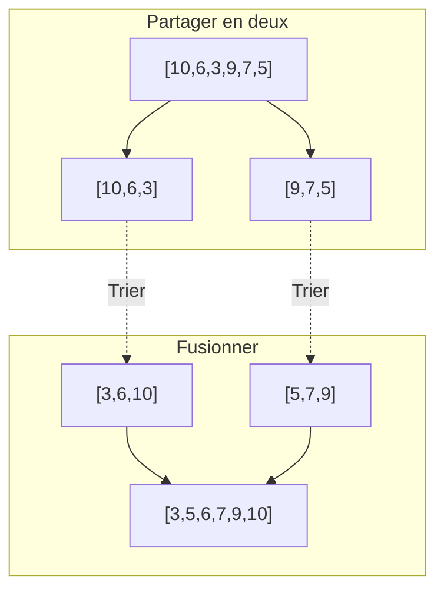




{{ titre_chapitre(num,titre,theme)}}
 
## Activités 

{{ titre_activite("Recherche dans une liste",["rappel"],0) }}

!!! Aide
    Cette activité revient sur deux algorithmes de recherche d'un élément dans une liste déjà rencontrés en classe de première et sur la comparaison de leurs efficacités. En cas de difficultés, on pourra donc revenir sur les activités correspondantes :

    * [recherche par parcours simple](https://fabricenativel.github.io/NSIPremiere/notionsalgo/#activite-1-rechercher-dans-une-liste){target=_blank}
    * [recherche dichotomique](https://fabricenativel.github.io/NSIPremiere/notionsalgo/#activite-2-recherche-dichotomique){target=_blank}
    * [comparaison des temps d'exécution](https://fabricenativel.github.io/NSIPremiere/notionsalgo/#activite-3-complexite-dun-algorithme){target=_blank}

1. Ecrire une fonction `recherche(x,l)` qui en effectuant un parcours simple de la liste, renvoie `True` ou `False` selon que l'élément `x` se trouve ou non dans la liste `l`.

2. On suppose maintenant que la **liste est triée**, l'algorithme de recherche par dichotomie vue en classe de première consiste alors à <br>
    :one: partager la liste en deux listes de longueurs égales (à une unité près) <br>
    :two: comparer  l'élément recherché avec celui situé au milieu de la liste<br>
    :three: en déduire dans quelle moitié poursuivre la recherche<br>
    On s'arrête lorsque la zone de recherche ne contient plus qu'un élément.

    1. Faire fonctionner "à la main" cet algorithme pour rechercher `6` dans `[1,3,5,7,11,13]`.
    2. Programmer cet algorithme.
    
3. Que dire de l'efficacité de ces deux algorithmes ?

{{ titre_activite("Tri fusion",[]) }}

1. Algorithmes de tri vus en première
    1. Rappeler rapidement le principe du [tri par sélection](https://fabricenativel.github.io/NSIPremiere/algostri/#activite-1-tri-par-selection){target=_blank} vu en classe de première. Donner les étapes de cet algorithme pour trier la liste `[10,6,3,9,7,5]`
    2. Rappeler rapidement le principe du [tri par insertion](https://fabricenativel.github.io/NSIPremiere/algostri/#activite-2-tri-par-insertion){target=_blank} vu en classe de première. Donner les étapes de cet algorithme pour trier la liste `[10,6,3,9,7,5]` 
    3. Quelle est la complexité de ces deux algorithmes ?

3. L'algorithme du **tri fusion** consiste à : <br>
:one: partager la liste en deux moitiés (à une unité près), <br>
:two: trier chacune des deux moitiés, <br>
:three: les fusionner pour obtenir la liste triée. <br>
On a schématisé le tri de la liste `[10,6,3,9,7,5]` suivant ce principe ci-dessous :

    1. Le tri des deux moitiés est lui-même effectué par tri fusion, par conséquent que peut-on dire de cet algorithme ?
    1. On a schématisé ci-dessous le fonctionnement complet de l'algorithme pour la liste `[10,6,3,9,7,5]`, recopier et compléter les cases manquantes.

        ```mermaid
            graph TD
                    subgraph Partager en deux
                    S["[10,6,3,9,7,5]"] --> S1["[10,6,3]"]
                    S --> S2["[9,7,5]"]
                    S1 --> S11["[10]"]
                    S1 --> S12["[6,3]"]
                    S2 --> S21["[9]"]
                    S2 --> S22["[...,...]"]
                    S12 --> S121["[6]"]
                    S12 --> S122["[3]"]
                    S22 --> S221["[...]"]
                    S22 --> S222["[...]"]
                    end
                    subgraph Fusionner
                    S121 --> T21["[...,...]"]
                    S122 --> T21
                    S221 --> T22["[5,7]"]
                    S222 --> T22["[5,7]"]
                    S11 --> T1["[...,...,...]"]
                    T21 --> T1
                    S21 --> T2["[...,...,...]"]
                    T22 --> T2
                    T1 --> T["[3,5,6,7,9,10]"]
                    T2 --> T
                    end

        ```

2. Implémentation en Python
    1. Programmer une fonction `partage(l)` qui prend en argument une liste `l` et renvoie les deux moitiés `l1` et `l2` (à une unité près) de `l`. Par exemple `partage([3,7,5])` renvoie `[3]` et `[7,5]`.

        !!! aide
            * Penser à utiliser les constructions de listes par compréhension
            * Les *slices* de Python sont un moyen efficace d'effectuer le partage, mais leur connaissance n'est pas un attendu du programme de terminale. Les élèves intéressés pourront leur propre recherche sur le *Web*.

    2. On donne ci-dessous une fonction `fusion(l1,l2)` qui prend en argument deux listes **déjà triées** `l1` et `l2` et renvoie la liste triée `l` fusion de `l1` et `l2` :
        
        ```python linenums="1"
        def fusion(l1,l2):
            ind1=0
            ind2=0
            l = []
            while ind1<len(l1) and ind2<len(l2):
                if l1[ind1]<l2[ind2]:
                    l.append(l1[ind1])
                    ind1+=1
                else:
                    l.append(l2[ind2])
                    ind2+=1
            if ind1==len(l1):
                for k in range(ind2,len(l2)):
                    l.append(l2[k])
            else:
                for k in range(ind1,len(l1)):
                    l.append(l1[k])
            return l
        ```

        1. Recopier et tester cette fonction.
        2. Quel est le rôle des variables `ind1` et `ind2` ?
        3. Ajouter un commentaire décrivant le rôle de la boucle `while`.
        4. Ajouter un commentaire décrivant le rôle des lignes 12 à 17.
    
    3. En utilisant les deux fonctions précédentes, écrire une fonction `tri_fusion(l)` qui implémente l'algorithme du tri fusion en Python.

    !!! Important
        On montre que l'algorithme du tri fusion a une complexité en $O(n\log(n))$, c'est donc un algorithme plus efficace que le tri par insertion ou le tri par sélection qui ont tous les deux une complexité en $O(n^2)$.
## Cours

{{ aff_cours(num) }}


## Exercices

{{ exo("Maximum des éléments d'une liste",[],0) }}
On propose l'algorithme suivant pour la recherche du maximum des éléments d'une liste :<br>
:one: Partager la liste en deux moitiés `l1` et `l2` <br>
:two: Chercher les maximums `m1` de `l1` et `m2` de `l2` <br>
:three: En déduire le maximum `m` de `l`.

1. Expliquer pourquoi cet algorithme fait partie de la méthode **diviser pour régner**.
2. Cet algorithme est-il récursif ? Justifier.
3. Ecrire une implémentation en Python de cet algorithme.

{{ exo("Inversions dans une liste",["bac"]) }}
*Cet exercice est extrait  d'un sujet de {{sc("bac")}} de la session 2021*

Dans un tableau Python d'entiers `tab`, on dit que le couple d'indice `(i,j)` forme une inversion lorsque `i<j` et `tab[i]>tab[j]`. On donne ci-dessous quelques exemples.

* Dans le tableau `[1,5,3,7]` le couple d'indices `(1,2)` forme une inversion car `5>3`. Par contre, le couple  `(1,3)` ne forme pas d'inversion car `5<7`.<br>
Il n'y a qu'une inversion dans ce tableau
* Il y a trois inversions sans le tableau `[1,6,2,7,3]`, à savoir les couples d'indices `(1,2)`, `(1,4)` et `(3,4)`.
* On peut compter six inversions dans le tableau `[7,6,5,3]` : les couples d'indices `(0,1), (0,2), (0,3), (1,2), (1,3)` et `(2,3)`.
On se propose dans cet exercice de déterminer le nombre d'inversions dans un tableau quelconque

#### Questions préliminaires
1. Expliquer pourquoi le couple `(1,3)` est une inversion dans le tableau `[4,8,3,7]`.
2. Justifier que le couple `(2,3)` n'en est pas une.

#### Partie A : Méthode itérative
Le but de cette partie est d'ecrire une fonction itérative `nombre_inversion` qui renvoie le nombre d'inversions dans un tableau. Pour cela, on commence par écrire une fonction `fonction1` qui sera ensuite utilisé pour écrire la fonction `nombre_inversion`.

1. On donne la fonction suivante.

    ```python
        def fonction1(tab, i):
            nb_elem = len(tab)
            cpt = 0
            for j in range(i+1, nb_elem):
            if tab[j] < tab[i]:
            cpt += 1
            return cpt
    ```

    1. Indiquer ce que renvoie la `fonction1(tab,i)` dans les cas suivants :
        
        * Cas n°1 : `tab=[1,5,3,7]` et `i=0`
        * Cas n°2 : `tab=[1,5,3,7]` et `i=1`
        * Cas n°3 : `tab=[1,5,2,6,4]` et `i=1`
    
    2. Expliquer ce que permet de déterminer cette fonction.

2. En utilisant la fonction précédente, écrire une fonction `nombre_inversion(tab)` qui prend en argument un tableau et renvoie le nombre d’inversions dans ce tableau. On donne ci-dessous les résultats attendus pour certains appels.
    ```python
    >>> nombre_inversions([1,5,7])
    0
    >>> nombre_inversions([1,6,7,2,3])
    3
    >>> nombre_inversions([7,6,5,3])
    6
    ```
3. Quelle est l’ordre de grandeur de la complexité en temps de l'algorithme obtenu ? Aucune justification n'est attendue.

#### Partie B : Méthode récursive

Le but de cette partie est de concevoir une version récursive de la fonction `nombre_inverion`. On définit pour cela des fonctions auxiliaires.

1. Donner le nom d'un algorithme de tri ayant une complexité meilleure que quadratique.
Dans la suite de cet exercice, on suppose qu’on dispose d'une fonction `tri(tab)` qui prend en argument un tableau et renvoie un tableau contenant les mêmes éléments rangés dans l'ordre croissant.

2. Écrire une fonction `moitie_gauche(tab)` qui prend en argument un tableau tab et renvoie un nouveau tableau contenant la moitié gauche de tab. Si le nombre d'éléments de tab est impair, l'élément du centre se trouve dans cette partie gauche. On donne ci-dessous les résultats attendus pour certains appels.

    ```python
        >>> moitie_gauche([])
        []
        >>> moitie_gauche([4, 8, 3])
        [4,8]
        >>> moitie_gauche ([4, 8, 3, 7])
        [4,8]
    ```
Dans la suite, on suppose qu’on dispose de la fonction moitie_droite(tab) qui renvoie la moitié droite sans l’élément du milieu.

3. On suppose qu’une fonction `nb_inv_tab(tab1, tab2)` a été écrite. Cette fonction renvoie le nombre d’inversions du tableau obtenu en mettant bout à bout les tableaux `tab1` et `tab2`, à condition que `tab1` et `tab2` soient triés dans l’ordre croissant. On donne ci-dessous deux exemples d’appel de cette fonction :

    ```python
        >>> nb_inv_tab([3,7,9],[2,10])
        3
        >>> nb_inv_tab([7,9,13],[7,10,14])
        3
    ```
En utilisant la fonction `nb_inv_tab` et les questions précédentes, écrire une fonction récursive `nb_inversions_rec(tab)` qui permet de calculer le nombre d'inversions dans un tableau. Cette fonction renverra le même nombre que `nombre_inversions(tab)` de la partie A. On procédera de la façon suivante :
    
    * Séparer le tableau en deux tableaux de tailles égales (à une unité près).
    * Appeler récursivement la fonction `nb_inversions_rec` pour compter le nombre d’inversions dans chacun des deux tableaux.
    * Trier les deux tableaux (on rappelle qu'une fonction de tri est déjà définie).
    * Ajouter au nombre d'inversions précédemment comptées le nombre renvoyé par la fonction `nb_inv_tab` avec pour arguments les deux tableaux triés.


{{ exo("Quart de tour d'une image",[]) }}

1. Pour faire tourner une image carré de côté $2^n$ pixels d'un quart de tour à gauche, on propose la méthode suivante :
    
    * Diviser l'image en quatre quarts Q1,Q2,Q3,Q4 <br>
     {width=200}
    * Faire tourner chacun des quarts d'un quart de tour à gauche <br>
     {width=200}
    * Permuter chaque quart afin de le placer correctement <br>
     {width=200}
    
    Expliquer pourquoi cette méthode est une illustration de la technique diviser pour régner.

2. C'est algorithme est-il du type itératif ou récursif ? Justifier.
3. Découpage de l'image en quatres quarts à l'aide du module {{sc("pil")}} de manipulation d'images
    1. On a représenté une image carré de $n$ pixels de côté avec le système de coordonnées d'une image dans le module {{ sc("pil")}}. Quelles sont les coordonnées manquantes ? <br>
    {width=300}
    2. La méthode `crop` du module {{ sc("pil")}} permet d'extraire une portion rectangulaire d'une image en donnant les coordonnées des coins supérieur gauche et inférieur droit du rectangle. Compléter la fonction Python suivante qui prend en entrée une image et retourne les quatre quarts de cette image.

        ```python
            from PIL import Image
            def partage_quart(image):
                n = image.width
                if n > 1:
                    q1 = image.crop((0,0,n//2,n//2))
                    q2 = image.crop((...,...,...,...))
                    q3 = image.crop((...,...,...,...))
                    q4 = image.crop((...,...,...,...))
                    return q1,q2,q3,q4
        ```

    3. Tester cette fonction (on pourra utiliser [cette image carré](./images/C4/Jess.jpg))

        !!! aide
            * La création d'une image dans {{ sc("pil")}} à partir d'un fichier s'effectue à l'aide de :
            ```python
                img_test = Image.open("mettre ici le nom du fichier")
            ```
            * La visualisation d'une image s'effectue à l'aide de :
            ```python
                img_test.show()
            ```

    4. Ajouter une instruction `assert` permettant de vérifier que l'image est carré (c'est à dire `image.width==image.height`)
    5. Ajouter une instruction `assert` permettant de vérifier que `n` est pair.

4. Compléter puis tester la fonction python qui implémente l'algorithme décrit à la question 1.
```python
    def quart_tour(image):
        n = image.width
        # Partage de l'image en quatre quarts
        if n>1:
            q1,q2,q3,q4 = partage_quart(image)
            # Rotation de chacun des quarts
            rq1 = quart_tour(q1)
            rq2 = quart_tour(q2)
            rq3 = quart_tour(q3)
            rq4 = quart_tour(q4)
            # Reconstruction de l'image
            resultat = Image.new('RGB',image.size)
            resultat.paste(rq2,(0,0))
            resultat.paste(...,(n//2,0))
            resultat.paste(rq1,(...,...))
            resultat.paste(...,(...,...))
            return resultat
        else:
            return image
```

{{ exo("Algorithme de Karatsuba",["maths","dur"]) }}

1. Principe de l'algorithme :
    1. On a posé ci-dessous la multiplication de deux nombres à deux chiffres : $42 \times 37$, combien de multiplications de nombres à un chiffre (illustrés par les flèches) sont nécessaires à ce calcul ?
    {: .imgcentre}
    2. Compléter le calcul en ligne correspond à l'opération ci-dessus : <br>
    $(40+2) \times (30+7) = (...\times...) + (...\times...) + (...\times...) + (...\times...)$
    2. Si on multiplie deux nombres à $n$ chiffres de la même façon, combien de multiplications de nombres à un chiffre sont nécessaires ?

    3. En base 10, le produit $P$ de deux nombres à $2n$ chiffres peut s'écrire : <br>
        $P=(a\times 10^n + b)(c\times 10^n + d) = ac\times 10^{2n} + (ad+bc)\times10^n + bd$ <br>
        Vérifier l'égalité :<br>
        $P= ac\times 10^{2n} + \left(ac+bd-(a-b)(c-d)\right)\times10^n + bd$
    
    4. Combien de multiplications sont nécessaires au calcul de $P$ sous cette forme ?
    5. Calculer le produit $42 \times 37$ sous cette forme.

2. Ecrire en Python une implémentation de l'algorithme de Karabutsa.

    !!! aide
        On pourra utiliser la fonction `nb_chiffres(n)` ci-dessous qui renvoie le nombre de chiffres en base 10 de l'entier positif `n`
        
        ```python
            from math import floor, log10

            def nb_chiffres(n):
                assert type(n)=int, "L'argument doit être entier"
                assert n>=0, "L'argument doit être positif"
                if n>0:
                    return floor(log10(n))+1
                else:
                    return 1
        ```

    !!! lien "Pour aller plus loin"
        Consulter la [page wikipédia sur l'algorithme de Karatsuba](https://fr.wikipedia.org/wiki/Algorithme_de_Karatsuba){target=_blank}

{{ exo("Quicksort",["dur"]) }}

1. Consulter la [page wikipédia sur l'algorithme du tri rapide](https://fr.wikipedia.org/wiki/Tri_rapide){target=_blank}
    1. Expliquer rapidement le fonctionnement de cet algorithme de tri.
    2. Justifier qu'il utilise la méthode diviser pour régner.
    3. Donner un exemple du fonctionnement de cet algorithme sur une liste de petite taille.
2. Proposer une implémentation en python de cet algorithme.