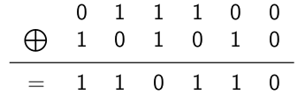
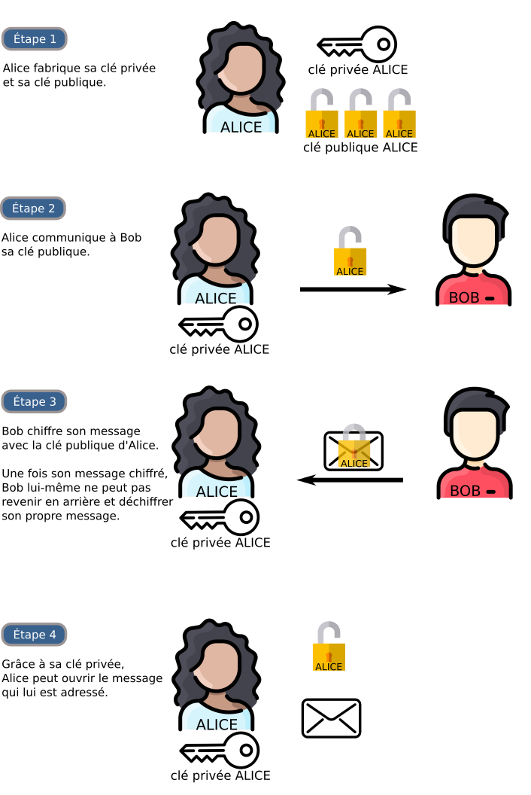




{{ titre_chapitre(num,titre,theme)}}
 
Ce cours s'inspire largement de [celui de G. Lassus](https://glassus.github.io/terminale_nsi/T5_Architecture_materielle/5.4_Cryptographie/cours/){target=_blank} (merci pour les illustrations)

## Activités 

{{ titre_activite("Chiffrement symétrique",[],0) }}

1. Opération {{sc("xor")}}  
En Python, on peut effectuer un *ou exclusif* bit à bit sur les représentations binaires de deux entiers à l'aide de l'opérateur `^`. Par exemple pour effectuer `28 ^ 42`:
    * Convertir 28 en binaire : $(28)_{10} = (11100)_2$
    * Convertir 42 en binaire : $(42)_{10} = (101010)_2$
    * Effectuer un {{sc("xor")}} bit à bit :  
    {: width=280px .imgcentre}
    En effet, on rappelle que $A \bigoplus B$ vaut 1 lorsque $A$ ou $B$ vaut 1 mais pas les deux à la fois (d'où le nom ou *exclusif*)
    * Convertir le résultat en entier : $(110110)_2 = (54)_{10}$

        a. Vérifier en utilisant Python, qu'on obtient bien `28 ^ 42 = 54`
        
        b. Comme dans l'exemple ci-dessus, calculer `65 ^ 42`, vérifier votre résultat avec Python.

        c. Calculer `(65 ^ 42)^42`, que remarquez-vous ?

        d. A l'aide d'un programme Python, vérifier que pour tout entier `n` compris entre 0 et 255, on a : `(n ^ 42) ^ 42 = n`

        !!! note
            On admet, sans démonstration que l'opération {{sc("xor")}} est **symétrique** c'est à dire que pour tout entier `n` et `m` : `(n ^ m) ^ m = n`.

2. Chiffrement avec {{sc("xor")}}  
On décide d'utiliser l'opération {{sc("xor")}} pour chiffrer un message, on choisit un entier compris entre 0 et 255 qui sert de *clé de chiffrement*. Pour chiffrer un message, on effectue un {{sc("xor")}} entre le code {{sc("ascii")}} de chaque caractère du message et la clé de chiffrement. Par exemple, pour coder le mot `NSI` avec la clé 42 :
    * On récupère les codes {{sc("ascii")}} de chaque lettre : `N` : 78, `S` : 83 et `I` : 73.
    * On effectuer un {{sc("xor")}} avec la clé de chiffrement 42 : `78^42 = 100`, `83^42 = 121`, `73 ^ 42 = 99`
    * On remplace avec le caractère ayant ce code {{sc("ascii")}} : 100 : `d`, 121 : `y`, 99 : `c`
    * Le chiffrement de `NSI` est donc `dyc`

        a. Ecrire une fonction python `chiffre_xor` qui prend deux arguments (le texte à chiffrer et la clé de chiffrement) et renvoie le message chiffré. Par exemple `chiffre_xor("NSI",42)` doit renvoyer `dyc`.

        !!! aide
            On rappelle qu'en python :

            * la fonction `ord` renvoie le code {{sc("ascii")}} du caractère donné en paramètre. Par exemple, `ord("N")` renvoie 78.
            * la fonction `chr` renvoie le caractère dont le code {{sc("ascii")}} est donné en paramètre. Par exemple, `chr(100)` renvoie  `d`.

        b. Expliquer et justifier comment peut s'effectuer le déchiffrage d'un message avec cette technique. Quelle est la clé de déchiffrement ?

        c. Déchiffrer le message `qARE\E\F@REVIAÚF@@Z` sachant que la clé de chiffrement était 51.

        d. Un chiffrage est dit *symétrique* lorsque les clés de chiffrement et de de déchiffrement doivent être secrètes (elles peuvent donc être identiques ou alors la connaissance de l'une permet aisément d'obtenir l'autre). Le chiffrement par {{sc("xor")}} défini ci-dessus est-il symétrique ?

        e. Le chiffrement par le [code de César](https://en.wikipedia.org/wiki/Caesar_cipher){target=_blank} est-il symétrique ?

        f. Dans le cas d'un chiffrement symétrique, deux personnes peuvent-elles s'échanger des messages si elles n'ont pas encore convenu ensemble d'une clé de chiffrement ? En déduire un inconvénient de cette méthode de chiffrement.

    !!! note
        Pour prolonger cette activité on pourra faire [l'exercice 3 de ce sujet de Bac 2021](http://localhost:8000/Annales/2021/EE/#centres-etrangers-candidats-libres-sujet-2-21-nsij2g11){target=_blank} dont la correction se trouve [ici](http://localhost:8000/Annales/Corriges/21-EtrangerJ2/#exercice-3){target=_blank}. En effet, cet exercice traite du chiffrement par {{sc("xor")}} en utilisant une chaîne de caractère comme clé.


{{ titre_activite("Chiffrement asymétrique",["maths"]) }}

Dans un chiffrement **asymétrique**, la clé de chiffrement est **publique** et donc n'importe qui peut chiffrer un message. La clé de déchiffrement est par contre **privée** (et seul celui qui la possède peut déchiffrer). Le principe est donc qu'on ne peut pas (ou pas *"facilement"*) déduire de la clé de chiffrement (publique), la clé de déchiffrement (secrète).
Le principe d'un chiffrement asymétrique est illustré ci-dessous (crédit : G. Lassus): 
{width=500px .imgcentre}
Dans cette activité, après quelques rappels mathématiques, nous allons détailler chacune de ses étapes sur un exemple très connu de chiffrement asymétrique : l'algorithme **RSA** des initiales de ses trois inventeurs (Ron **R**ivest, Adi **S**hamir et Leonard **A**delman). Pour plus de détails historique, voir par exemple [ce site](https://glassus.github.io/terminale_nsi/T5_Architecture_materielle/5.4_Cryptographie/cours/#231-histoire){target=_blank}

!!! Attention
    La compréhension de l'algorithme demande des notions d'arithmétique qui pourront sembler ardues aux élèves ne faisant pas l'enseignement de spécialités mathématiques. Ces prérequis, sont présentés en début d'activité. On pourra simplement retenir *pour résumer* et façon *imparfaite* que dans le chiffrement RSA :

    * la clé publique est un *très* grand nombre $n$ (plusieurs centaines de chiffres) choisi de façon à être le produit de deux nombres premiers,
    * la clé privée est le couple $(p,q)$ de nombres premiers tels que $n=p\times q$,
    * étant donnée la taille de $n$, il est *difficile* (impossible avec la puissance de calcul actuelle des ordinateurs) de retrouver $p$ et $q$ à partir de $n$. Et donc la connaissance de la clé publique ne permet pas d'en déduire celle de la clé privée.

1. Arithmétique modulaire  
    a. Il est 22h, quelle heure sera-t-il 8h plus tard ?

    b. Si vous avez répondu 6h (et pas 30h à la question précédente), vous venez de faire de l'*arithmétique modulaire*, en effet vous n'avez conservé que le reste dans la division euclidienne par 24:  
    $30 = 1 \times 24 + 6$ on écrira que $30 \equiv 6 [24]$ et on lira $30$ est égal à $26$ modulo $24$ (ce qui peut se traduire par leur différence est un multiple de 24, c'est donc la même heure sur des jours différents).

    c. Vérifier (en faisant la division euclidienne) que $42 \equiv 18 [24]$

    d. Vérifier (en faisant la division euclidienne) que $103 \equiv 7 [24]$

    e. Compléter : $13 \equiv \dots [5]$

    f. Compléter : $42 \equiv \dots [7]$

2. Nombres premiers et nombres premiers entre eux.

    a. Rappeler la définition d'un nombre premier. Les nombres suivants sont-ils premiers (justifier) : 12, 21, 29, 1 ?

    b. On dit que deux nombres sont *premiers entre eux* lorsque leur {{sc("pgcd")}} vaut 1, par exemple 12 et 5 sont premiers entre eux mais pas 33 et 27 (leur {{sc("pgcd")}} vaut 3). Donner la liste des nombres premiers avec 12 et inférieurs à 12.

3. Algorithme RSA - étape 1 : création de la clé publique et de la clé privée

    * Choisir deux nombres premiers $p$ et $q$ *très grands*. Pour disposer d'un exemple simple nous prendrons $p=3$ et $q=11$ 
    * Calculer le produit $n = p\times q$. Dans notre exemple $n = 3 \times 11 = 33$.
    * Choisir un nombre premier $e$ premier avec $\phi(n) = (p-1)(q-1)$. Dans notre exemple, on choisit $e=3$ qui est bien premier avec $20$ (comme $p=3$ et $q=11$, $\phi(33)=(p-1)(q-1)=20$).
    * La clé *publique* d'Alice est le couple $(e,n)$ et donc dans notre exemple le couple $(3,33)$. Rappelons que dans la réalité $n$ est un nombre très grand.
    * Pour déterminer la clé privé, il faut trouver un nombre $d$ tel que $ed \equiv 1 [\phi(n)]$. Dans notre exemple il s'agit donc de trouver $d$ tel que $3d \equiv 1 [20]$, le nombre 7 convient.

        !!! note
            On dit que $d$ est un inverse de $e$ modulo $\phi(n)$ (leur produit vaut 1 modulo $\phi(n)$). Dans la pratique un [algorithme](https://fr.wikipedia.org/wiki/Algorithme_d%27Euclide_%C3%A9tendu){target=_blank} permet la détermination de $d$.
    
    * Le couple $(d,n)$ est la clé privée qui permet le déchiffrage. Dans notre exemple c'est donc $(7,33)$.
    
    Soit le couple de nombre premiers $(p,q)$ avec $p=5$ et $q=13$ :

    a. Calculer $n$ et $\phi(n)$.
    
    b. Justifier que $(9,65)$ ne peut pas être une clé publique.

    c. Vérifier que $(11,65)$ est une clé publique.

    d. Vérifier que 35 est un inverse de 11 modulo 48.

    e. En déduire la clé privée.

    !!! important
        En résumé, la clé publique est $(e,n)$ et la clé publique est $(d,n)$. Puisque $d$ et $e$ sont inverses l'un de l'autre modulo $\phi(n)=(p-1)(q-1)$ on peut penser qu'il est simple de retrouver l'un à partir de l'autre, dans la pratique cela est extrêmement difficile car on ne connaît pas $\phi(n)$. En effet, $n$ étant très grand, il est difficile de calculer $p$ et $q$, car il n'existe pas d'algorithme efficace permettant de factoriser des nombres possédant plusieurs centaines de chiffres.

3. Algorithme RSA - étape 2 : chiffrer un message  
Pour envoyer un nombre secret $S$ en le chiffrant avec l'algorithme RSA de clé publique $(e,n)$, il faut calculer $S^e [n]$. Rappelons que dans notre exemple la clé publique pour chiffrer est $(3,33)$. Par exemple, pour envoyer le nombre secret 4, on calcule $4 ^ 3 [33] = 31$ et on envoie 31.


    a. Chiffrer le nombre secret 10 avec la clé $(3,33)$

    b. Chiffrer le nombre secret 17 avec la clé $(11,65)$

4. Algorithme RSA - étape 3 : déchiffrer un message  
Pour déchiffrer un message $M$ de clé privée $(d,n)$ il suffit de l'élever à la puissance $d$ et de calculer le reste dans la division euclidienne par $n$. Rappelons que dans notre exemple exemple $d=7$ et $n=33$. Si on reçoit le le message $M = 31$ on doit calculer : $31^7 = 27512614111$ puis chercher le reste modulo 33 : $27512614111 [33] = 4$, on retrouve bien le message de départ qui était 4.

    !!! note
        Cela repose sur le résultat suivant : si $e$ et $d$ sont inverses modulo $\phi(n)$ alors $M^{ed} \equiv M [n]$. Pour une démonstration, on pourra consulter [cette page](https://fr.wikipedia.org/wiki/Chiffrement_RSA#Justification){target=_blank}


    a. Déchiffrer le nombre secret 18 avec la clé $(7,33)$.

    b. Même question pour le nombre secret 90 avec la clé $(11,65)$.

5. Vous pouvez utiliser [cet outil en ligne](https://animations.interstices.info/interstices-rsa/rsa.html){target=_blank} afin de vérifier vos réponse à cette activité.


!!! important
    Le protocole `https` qui permet de sécuriser les transmissions sur le *Web* utilise à la fois :
    
    * un chiffrement asymétrique pour la génération de clés de chiffrement identiques chez le serveur et le client
    * un chiffrement symétrique (aujourd'hui [AES](https://en.wikipedia.org/wiki/Advanced_Encryption_Standard){target=_blank}) pour l'échange des données.

    Voir [cette page](https://glassus.github.io/terminale_nsi/T5_Architecture_materielle/5.4_Cryptographie/cours/#3-https-exemple-dutilisation-conjointe-dun-chiffrement-asymetrique-et-dun-chiffrement-symetrique){target=_blank} pour plus de détails.

## Cours

{{ aff_cours(num) }}


## Exercices

{{ exo("Vocabulaire",[],0) }}

1. Expliquer en quelques phrases la différence entre un chiffrement *symétrique* et un chiffrement *asymétrique*.
2. Donner un exemple de chiffrement symétrique.
3. Donner un exemple de chiffrement asymétrique.

{{ exo("Chiffre de César",[]) }}

1. Rappeler le principe du chiffrement de César
2. Ecrire en Python, une fonction `chiffre_cesar` qui prend en argument un texte et une clé de chiffrement `c` et renvoie le texte chiffré par la méthode de César avec un décalage de `c` emplacements. Par souci de simplicité, on supposera que le texte n'est composé que des 26 lettres majuscules de l'alphabet et on ne chiffre ni les espaces ni les symboles de ponctuation.

    !!! aide
        On rappelle qu'en python :

        * la fonction `ord` renvoie le code {{sc("ascii")}} du caractère donné en paramètre. Par exemple, `ord("N")` renvoie 78.
        * la fonction `chr` renvoie le caractère dont le code {{sc("ascii")}} est donné en paramètre. Par exemple, `chr(100)` renvoie  `d`.
        * `n%26` donne le reste dans la division euclidienne de `n` par 26.

3. Le chiffre de César peut-être cassé par *analyse fréquentielle*, comme expliqué ci-dessous :
    <div class="centre"><iframe width="560" height="315" src="https://www.youtube.com/embed/sMOZf4GN3oc" title="YouTube video player" frameborder="0" allow="accelerometer; autoplay; clipboard-write; encrypted-media; gyroscope; picture-in-picture" allowfullscreen></iframe></div> 
    En utilisant cette technique, écrire un programme Python permettant de déchiffrer le message suivant :
    ```
    PFOJC JCIG OJSN FSIGGW O RSQCRSF QS ASGGOUS
    Q SGH HFSG PWSB AOWG WZ FSGHS SBQCFS PSOIQCID O TOWFS
    ```

4. Décoder de nouveau le message précédent en utilisant la bibliothèque [sympy](https://docs.sympy.org/latest/modules/crypto.html){target=_blank}

{{ exo("Factorisation",[]) }}

On rappelle que la fiabilité de l'algorithme {{sc("rsa")}} est lié à la difficulté de trouver en connaissant un nombre $n$ les deux nombres premiers $p$ et $q$ tels que $n = pq$. Cet exercice a pour but de le vérifier. Le module Crypto de python permet de générer des nombres premiers de n'importe quelle taille :
```python
from Crypto.Util import number
from Crypto.Random import get_random_bytes 

# Taille des nombres (en bits)
n_length = 20

# Génération de deux nombres premiers p et q de cette taille
p = number.getPrime(n_length,randfunc=get_random_bytes)
q = number.getPrime(n_length,randfunc=get_random_bytes)
```

1. Recopier ce programme, le tester et le compléter afin de calculer $n = pq$.
2. Ecrire une fonction `factorise` qui prend en argument un entier `n` et renvoie deux entiers `p` et `q` tels que `n = p*q`.

    !!! aide
        On pourra utiliser l'algorithme très simple qui consiste à essayer toutes les divisions possibles jusqu'à en trouver une dont le reste est 0.

3. Tester votre fonction `factorise` et vérifier qu'elle permet de retrouve `p` et `q` à partir de `n`

4. Modifier la valeur du paramètre `n_length` et  mesurer les temps d'execution.

    !!! attention
        Ne pas choisir une valeur trop élevé pour `n_length`, prendre par exemple 21 puis 22, 23, ... et observer l'augmentation correspondante du temps de calcul.

5. Prévoir le temps d'execution pour `n_length = 100`
6. La majorité des sites *Web* actuel utilise actuellement des clés de longueur 1024. Quel serait le temps d'exécution prévisible de votre programme pour casser une de ces clés ?

    !!! lien
        La vidéo ci-dessous revient sur l'algorithme RSA et donne les longueurs des plus longues clés cassées à ce jour.
        <div class="centre">
        <iframe width="560" height="315" src="https://www.youtube.com/embed/M7kEpw1tn50" title="YouTube video player" frameborder="0" allow="accelerometer; autoplay; clipboard-write; encrypted-media; gyroscope; picture-in-picture" allowfullscreen></iframe></div>


{{ exo("Autorité de certification",[]) }}

Comme vu en cours, une *autorité de certification* assure de l'identité d'un site afin d'éviter des attaques du type [*homme du milieu*](https://en.wikipedia.org/wiki/Man-in-the-middle_attack){target=_blank}, sans laquelle on pourrait se connecter à un site tiers en pensant qu'il s'agit par exemple de sa banque en ligne. Les requêtes `https` peuvent être observées à partir de la console de firefox. Pour cela :

1. Lancer Firefox et ouvrir la console (menu *outils supplémentaires > console du navigateur* ou avec le raccourci clavier ++ctrl+shift+j++) et sélectionner l'onglet *Requêtes* (à droite)
2. Dans la barre d'adresse du navigateur taper `wikipedia.fr`, les requêtes défilent dans la console, cliquer sur la requête : `GET https://www.wikipedia.fr` puis l'onglet sécurité à droite. Retrouver les informations suivantes :
    * La version du protocole TLS utilisé
    * Le nom de l'autorité de certification
    * La période de validité du cerfificat d'identité


{{ exo("Implémentation de l'algorithme RSA",[]) }}

On rappelle que l'algorithme {{sc("rsa")}} impose de trouver l'inverse d'un nombre $d$ modulo $\phi(n)$. Cela peut être fait en utilisant l'[algorithme d'Euclide étendu](https://fr.wikipedia.org/wiki/Algorithme_d%27Euclide_%C3%A9tendu){target=_blank}

1. Proposer une implémentation en Python de cet algorithme.
2. Proposer une implémentation en Python de l'algorithme de chiffrement {{sc("rsa")}}
