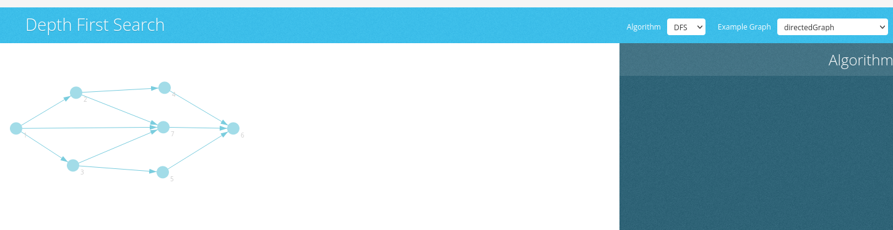




{{ titre_chapitre(num,titre,theme)}}
 
## Activités 

{{ titre_activite("Le problème des ponts de Königsberg",[],0) }}
<div class="centre">
<iframe width="560" height="315" src="https://www.youtube.com/embed/nZwSo4vfw6c" title="YouTube video player" frameborder="0" allow="accelerometer; autoplay; clipboard-write; encrypted-media; gyroscope; picture-in-picture" allowfullscreen></iframe>
</div>

Voici une illustration du problème des septs points de Königsberg extrait de la vidéo précédente :
{: width=560px .imgcentre}
On rappelle que le but du problème est de trouver un chemin qui permet de passer une seule et unique fois par chaque pont de la ville.

1. Faire quelques essais, que penser de ce problème ?
2. Vers les graphes

    a. On divise la ville en quatre zones notées **N** (nord de la ville), **S** (sud de la ville), **I** (île centrale) et **E** (est de la ville) comme illustré ci-dessous. Faire un schéma en représentant chaque zone par un rond et un pont par un lien entre ces zones.
    {: width=560px .imgcentre}

    !!! Aide
        Vous devriez obtenir un schéma similaire à  :
        <div class="centre">
        ```mermaid
        graph TD
        N(("N"))
        I(("I"))
        S(("S"))
        E(("E"))
        N-- 1 ---I
        N-- 2 ---I
        I-- 6 ---S
        I-- 7 ---S
        I-- 4 ---E
        N-- 3 ---E
        E-- 5 ---S
        ```
        </div>

    b. Le schéma obtenu s'appelle un **graphe**, rechercher sur le *Web* comment se nomment les zones et les ponts dans le vocabulaire de la théorie des graphes.

    c. Donner le **degré** de chaque sommet de ce graphe

    !!! aide
        On pourra remarquer que les arbres sont des graphes particuliers et se rappeler de la notion de degré (ou arité) d'un noeud dans un arbre.

3. Preuve mathématique

    a. Supposons qu'une solution au problème qui commence et finit dans la même zone existe, en déduire une propriété du degré de chaque sommet.

    !!! aide
        Raisonner sur le fait que si on entre dans une zone, il faut pouvoir en sortir par un pont non encore utilisé.

    b. Même question si on suppose que la solution commence et finit dans deux zones différentes.
    
    !!! aide
        Traiter séparément des autres zones, celle de départ et d'arrivée.

4. Pour aller plus loin ...
    
    a. En supprimant un seul pont, est-il possible d'obtenir une solution au problème ? Si oui lequel ?

    b. Même question en construisant un nouveau pont.


{{ titre_activite("Vocabulaire sur les graphes",[]) }}

1.  En vous aidant de vos connaissances sur l'île de la Réunion (et si besoin du *Web*), dessiner le graphe représentant le réseau routier de la Réunion. On fera uniquement figuré les villes suivantes comme sommet du graphe : Saint-Denis, Saint-André, Saint-Benoît, Le Tampon, Saint-Pierre, Cilaos, Saint-Louis, Saint-Paul, Saint-Denis, Saint-Joseph, Salazie.
2. Rechercher la signification des *voisins* d'un sommet d'un graphe. Donner la liste des voisins de Saint-Benoît.
3. On suppose qu'on rajoute La Nouvelle et Aurère (des écarts de Mafate) comme sommets et qu'une route est construite entre ces deux villages. Quelle propriété du graphe n'est plus valide ?
4. On suppose qu'on ajoute La Possession comme sommet, et qu'on fait figurer les deux routes permettant de relier Saint-Denis (La route en corniche et la route de la montagne). Que dire de ce nouveau graphe ?
5. On suppose que la route de la montagne est maintenant à sens unique et ne peut être emprunté que dans le sens Saint-Denis vers La Possession. Que dire de ce nouveau graphe ?
6. On suppose maintenant que sur le graphe initial, on fait figurer la distance entre les deux villes. Comment s'appelle ce type de graphe ?


{{ titre_activite("Implémentation avec matrice d'adjacence",[]) }}

1. Principe de l'implémentation  
    On prend l'exemple du graphe orienté suivant à 4 noeuds :
    <div class="centre">
            ```mermaid
            graph LR
            A(("A"))
            B(("B"))
            C(("C"))
            D(("D"))
            A --> B
            A --> C
            B --> C
            B --> D
            C --> D
            ```
            </div>
        
    a. Recopier et compléter le tableau suivant dans lequel les lignes et les colonnes représentent les sommets et dans lequel on indique par un **1** la présence d'une arête allant du sommet de la ligne vers celui de la colonne et par **0** son absence
    {: width=240px .imgcentre}

    !!! note
        Si on numérote les sommets du graphe (A le numéro 1, B le numéro 2, ...), il n'est plus nécessaire d'indiquer les noms des sommets sur les lignes et les colonnes.
    
    b. De façon générale, une **matrice** en mathématiques est un tableau de nombres, ici, on a donc représenté notre graphe par une matrice appelé **matrice d'adjacence** de ce graphe :
    $$\begin{pmatrix}
    0 & 1 & 1 & 0 \\\
    \dots & \dots  & \dots & \dots \\\
    \dots & \dots  & \dots & \dots \\\
    \dots & \dots  & \dots & \dots \\\
    \dots & \dots  & \dots & \dots \\\
    \end{pmatrix}
    $$
    En nommant les sommets $S_1, S_2, S_3$ et $S_4$, dessiner le graphe dont la matrice d'adjacence est :
    $$\begin{pmatrix}
    0 & 0 & 1 & 1 \\\
    1 & 0 & 0 & 0 \\\
    1 & 0 & 0 & 0 \\\
    1 & 1 & 1 & 0 \\\
    \end{pmatrix}
    $$
    c. Que peut-on dire d'un graphe dont la matrice d'adjacence est symétrique par rapport à sa diagonale principale ?

    d. Proposer une méthode pour représenter un graphe pondéré par une matrice d'adjacence.

2. Implémentation en python  
On s'inspire de ce qui a été fait pour les arbres et on utilisera la {{sc("poo")}} pour représenter un graphe par sa matrice d'adjacence. Enfin, on suppose qu'on implémente des graphes orientés.

    1. Quelle type de données de Python est souhaitable pour représenter les sommets ?
    2. Même question pour la matrice d'adjacence
    3. Pour le constructeur de la classe Graphe, on propose de fournir uniquement les sommets et de créer l'objet graphe ayant sa matrice d'adjacence vide initialement. De plus on ajoute un attribut `taille` au graphe. Compléter le code ci-dessous :

    ```python
    class Graphe:

        def __init__(self,sommets):
            self.sommets=sommets
            self.taille = len(......)
            self.matrice = .............
    ```

    4. Poursuivre cette implémentation en ajoutant une méthode d'ajout d'une arête. 

        !!! aide
            * Cette méthode prend en paramètre l'origine et l'extrémité de l'arête à ajouter.
            * On pourra vérifier que l'origine et l'extrémité sont bien dans la liste de sommets et rechercher leur position grâce à la méthode `index` des listes de python.

    5. Ajouter une méthode de suppression d'une arête
    6. Ajouter une méthode d'affichage de la matrice d'adjacence
    7. Ecrire la méthode `voisins` qui prend en paramètre un sommet et renvoie la liste de ses voisins.

{{ titre_activite("Implémentation avec des listes d'adjacences",[]) }}

1. Principe de l'implémentation  
    On reprend l'exemple du graphe orienté déjà utilisé à l'activité précédente 
    <div class="centre">
            ```mermaid
            graph LR
            A(("A"))
            B(("B"))
            C(("C"))
            D(("D"))
            A --> B
            A --> C
            B --> C
            B --> D
            C --> D
            ```
            </div>

    a. Compléter le schéma suivant où on a fait figuré à côté de chaque sommet la liste des sommets adjacents :

    * `A : B,C`
    * `B : ...`
    * `C : ...`
    * `. : ...`

    b. Dessiner le graphe dont la représentation par liste d'adjacence est :

    * `R : S`
    * `S : R,T,U,V`
    * `T : V`
    * `U :`
    * `V : R,U`

2. Implémentation en Python  
On donne ci-dessous le constructeur d'une classe `Graphe` qui implémente les graphes sous la forme de listes d'adjacence :
```python
class Graphe:

    def __init__(self,sommets):
        self.taille = len(sommets)
        self.listes = {}
        for s in sommets:
            self.listes[s]=[]
```

    a. Quel est le type de l'attribut `listes` d'un objet de la classe `Graphe` ?

    b. On suppose qu'on crée un objet de la classe `Graphe` en donnant en paramètre la liste  `["A","B","C","D"]`. Quel est alors le contenu de l'attribut `listes` de cet objet ?

    c. Poursuivre cette implémentation en ajoutant une méthode d'ajout d'une arête. 

    d. Ajouter une méthode de suppression d'une arête

    e. Proposer une méthode permettant d'ajouter un sommet.

    f. Proposer une méthode permettant de supprimer un sommet.
    
    g. Ecrire la méthode `voisins` qui prend en paramètre un sommet et renvoie la liste de ses voisins.

{{ titre_activite("Parcours d'un graphe",[]) }}

1. Visualisation d'un parcours *depth first search*  
    Un [outil en ligne](https://workshape.github.io/visual-graph-algorithms/#dfs-visualisation){target=_blank}, permet de visualiser le résultat du parcours en profondeur d'un graphe. Un graphe est donné en exemple, mais vous pouvez le modifier ou construire le votre :
    [{: width=600px .imgcentre}](https://workshape.github.io/visual-graph-algorithms/#dfs-visualisation){target=_blank}

    !!! attention
        Dans les menus déroulants, bien choisir Alorithme : **DFS** et Example graph : **directedGraph**

2. Visualisation d'un parcours *breadth first search*  
    Ce même [outil en ligne](https://workshape.github.io/visual-graph-algorithms/#bfs-visualisation){target=_blank}, permet de visualiser le résultat du parcours en largeur d'un graphe. Un graphe est donné en exemple, mais vous pouvez le modifier ou construire le votre :
    [{: width=600px .imgcentre}](https://workshape.github.io/visual-graph-algorithms/#bfs-visualisation){target=_blank}

    !!! attention
        Dans les menus déroulants, bien choisir Alorithme : **BFS** et Example graph : **directedGraph**

3. On considère le graphe suivant :
    <div class="centre">

    </div>

    a. Prévoir l'ordre de parcours pour un parcours en profondeur en commençant par le sommet `A`. Vérifier en testant dans l'outil en ligne.

    b. Même question pour un parcours en largeur.

## Cours

{{ aff_cours(num) }}


## Exercices

{{ exo("Vocabulaire sur les graphes",[],0) }}

On considère le graphe suivant :
<div class="centre">

    </div>

1. Ce graphe est-il orienté ? simple ? complet ? pondéré ?
2. Donner la liste des voisins de `C`.
3. Quel est le degré de `G` ?
4. Quels sont les sommets adjacents à `A` ?

{{ exo("Graphe complet",[]) }}

1. Rappeler la définition d'un graphe *complet*
2. Dessiner un graphe complet à cinq noeuds.
3. Combien d'arêtes possède ce graphe ?
4. Donner la matrice d'adjacence de ce graphe.
6. Quel est le nombre d'arêtes d'un graphe complet à $n$ noeuds ?

    !!! aide
        On pourra utiliser sans avoir à le prouver que :
        $$ 1 + 2 + \dots + n = \dfrac{n(n+1)}{2} $$

{{ exo("Représentation par matrice d'adjacence",[]) }}

1. Donner la matrice d'adjacence du graphe suivant :
    <div class="centre">
    ```mermaid
    graph LR
    A(("A"))
    B(("B"))
    C(("C"))
    D(("D"))
    E(("E"))
    A --- B
    A --- C
    C --- E
    D --- E
    B --- C
    C --- D
    ```
    </div>

2.  Dessiner le graphe dont la matrice d'adjacence est :
    $$\begin{pmatrix}
    0 & 1 & 1 & 0 & 0 \\\
    0 & 0 & 1 & 0 & 1 \\\
    1 & 1 & 0 & 0 & 0 \\\
    0 & 1 & 1 & 0 & 0 \\\
    0 & 1 & 1 & 0 & 0 \\\
    \end{pmatrix}
    $$

{{ exo("Représentation par listes d'adjacence",[]) }}

1. Donner la représentation sous forme de listes d'adjacences du graphe suivant :
    <div class="centre">
    ```mermaid
    graph LR
    A(("A"))
    B(("B"))
    C(("C"))
    D(("D"))
    E(("E"))
    A --- B
    A --- C
    C --- E
    D --- E
    B --- C
    C --- D
    ```
    </div>

2.  Dessiner le graphe dont la représentation sous forme de listes d'adjacence est :

    * A : [B]
    * B : [C,D,E]
    * C : [F]
    * D : [F]
    * E : [F]


{{ exo("Parcours d'un graphe",[]) }}

On considère le graphe suivant :
<div class="centre">
    ```mermaid
    graph LR
    A(("A"))
    B(("B"))
    C(("C"))
    D(("D"))
    E(("E"))
    F(("F"))
    G(("G"))
    A --> B
    A --> C
    G --> E
    C --> D
    D --> F
    B --> E
    E --> F
    A --> G
    ```
    </div>

1. Donner l'ordre de parcours des sommets pour un parcours en largeur en partant de A
2. Même question pour un parcours en profondeur

{{ exo("Implémentation par matrice d'adjacence",[]) }}

1. Récupérer, et revoir l'implémentation des graphes réalisée à l'[activité 3](./#activite-3-implementation-avec-matrice-dadjacence){target=_blank} :
    {{ telecharger("Implémentation graphes par matrice","./files/C11/graphes_matrice.py")}}


2. Utiliser cette implémentation pour créer le graphe de sommets `A,B,C,D,E` et dont la matrice d'adjacence est :
    $$\begin{pmatrix}
    0 & 1 & 1 & 0 & 0 \\\
    0 & 0 & 1 & 0 & 0 \\\
    0 & 0 & 0 & 1 & 1 \\\
    0 & 0 & 0 & 0 & 0 \\\
    0 & 0 & 0 & 0 & 0 \\\
    \end{pmatrix}
    $$

3. Ajouter la méthode `parcours_largeur` ci-dessous à cette implémentation en la complétant.
```python
def parcours_largeur(self,depart):
        assert depart in self.sommets
        a_traiter = [depart]
        deja_vu = [depart]
        pl  = []
        while a_traiter != []:
            sommet = a_traiter[0]
            voisins = self.get_voisin(sommet)
            # Ajout des sommets voisins non encore parcourus à ceux à traiter
            for v in .......:
                if v not in .....:
                    a_traiter......(v)
                    deja_vu.......(v)
            pl.append(sommet)
            a_traiter.....(0)
        return pl
```

4. Reconnaître la structure de données utilisée pour la variable `a_traiter`, expliquer pourquoi le choix d'une liste n'est pas judicieux.

5. Ajouter la méthode `parcours_profondeur` ci-dessous à cette implémentation en la complétant.
```python
def parcours_profondeur(self,start,parcourus=None):
        if parcourus == None:
            parcourus = []
        parcourus.append(start)
        for v in self...........(start):
            if v not in parcourus:
                self............(v,parcourus)
        return parcourus
```

6. Proposer une méthode permettant d'ajouter un sommet.

    !!! aide
        Penser aux conséquences pour la matrice d'adjacence

7. Proposer une méthode permettant de supprimer un sommet.

{{ exo("Implémentation par listes d'adjacence",[]) }}

Reprendre les questions de l'exercice précédent avec l'implémentation par liste d'adjacence réalisée à l'[activité 3](./#activite-4-implementation-avec-des-listes-dadjacences){target=_blank} :
    {{ telecharger("Implémentation graphes par listes","./files/C11/graphes_liste.py")}}