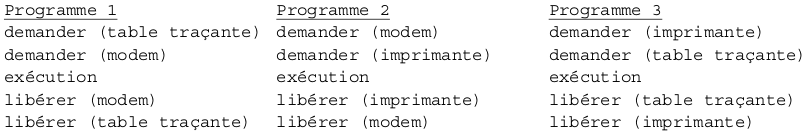




{{ titre_chapitre(num,titre,theme)}}
 
## Activités 

{{ titre_activite("Observer les processus",[],0) }}

1. Commande `ps`
    1. Consulter l'aide sur la commande `ps`, quel est le rôle de cette commande ?
    2. Tester la commande `ps` (sans option) dans un terminal. Qu'est-ce que `PID` du processus ?
    3. Tester les options suivantes de la commande `ps` et indiquer leur  rôle (en consultant l'aide de la commande ou en faisant vos propres recherches sur le *Web*)
        1. `ps -e` (ou `ps -A`)
        2. `ps -f` quelle est la signification de la colonne `PPID` ?
        3. `ps -x`

2. Processus et programme
    1. Lancer un terminal et y taper la commande `ps` sans aucune option, le résultat devrait être semblable à :
        ```
            PID   TTY          TIME CMD
            19149 pts/3    00:00:00 bash
            19336 pts/3    00:00:00 ps
        ```
        On va à présent lancer la calculatrice `gnome-calculator` à partir de ce terminal, pour conserver la main dans le terminal, il faut faire suivre la commande d'un `&`, il faut donc entrer : `gnome-calculator &`.
    2. Entrer de nouveau la commande `ps` pour constater l'apparition d'un nouveau processus, noter son `PID`.
    3. Lancer une nouvelle fois et de la même façon la calculatrice `gnome-calculator`. On a donc lancé deux fois le *même programme*, obtient-on deux fois le *même processus* ? Que peut-on en conclure sur les notions de programmes et de processus ?

    !!! Remarque
        La commande `pstree` permet de visualiser les processus sous la forme d'une arboresence.
        
3. Tuer un processus
    1. Recherche la page de documentation de la commande `kill`.
    2. A partir du terminal arrêter l'un des processus `gnome-calculator` crée à la question précédente.


{{ titre_activite("Le diner des philosophes",[]) }}

## Cours

{{ aff_cours(num) }}


## Exercices

{{ exo("Commandes Linux",[],0) }}

1. Rappeler le rôle des commandes suivantes :
    1. `ps`
    2. `pstree`
    3. `top` (ou `htop`)
    4. `kill`

2. Quelles commandes permettent d'effectuer les actions suivantes :
    1. Afficher les processus en cours de l'utilisateur toto
    2. Tuer le processus ayant pour `PID` 12139
    

{{ exo("Processus et interblocage",["bac"]) }}
*Cet exercice correspond aux parties A et B  d'un sujet de {{sc("bac")}} de la session 2021*

#### Partie A
 Pour chacune des questions, une seule des quatres réponses est exacte.

1. Parmi les commandes ci-dessous, laquelle permet d'afficher les processus en cours d'exécution ?
    1. `dir`
    2. `ps`
    3. `man`
    4. `ls`
2. Quelle abréviation désigne l'identifiant d'un processus dans un système d'exploitation de type {{ sc("unix") }} ?
    1. {{sc("pix")}}
    2. {{sc("sig")}}
    3. {{sc("pid")}}
    4. {{sc("sid")}}
3. Comment s'appelle la gestion du partage du processeur entre différents processus ?
    1. L'interblocage
    2. L'ordonnancement
    3. La planification
    4. La priorisation
4. Quelle commande permet d'interrompre un processus dans un système d'exploitation de type {{ sc("unix")}} ?
    1. stop
    2. interrupt
    3. end
    4. kill

#### Partie B
Un processeur choisit à chaque cycle d'exécution le processus qui doit être exécuté. Le tableau ci-dessous donne pour trois processus P1, P2,P3 : <br>
- la durée d'exécution (en nombre de cycles), <br>
- l'instant d'arrivée sur le processeur (exprimé en nombre de cycles à partir de 0)<br>
- le numéro de priorité<br>
Le numéro de priorité est d’autant plus petit que la priorité est grande. On suppose qu’à chaque instant, c’est le processus qui a le plus petit numéro de priorité qui est exécuté, ce qui peut provoquer la suspension d’un autre processus, lequel reprendra lorsqu’il sera le plus prioritaire.

|Processus|Durée d'exécution|Instant d'arrivée|Numéro de priorité|
|:---------:|:-----------------:|:-----------------:|:------------------:|
|P1       | 3 | 3 |1 |
|P2       | 3 | 2 |2 |
|P3       | 4 | 0 |3 |

1. Reproduire le tableau ci-dessous sur la copie et indiquer dans chacune des cases le processus exécuté à chaque cycle :

    

2. On suppose maintenant que les trois processus précédents s'exécutent et utilisent une ou plusieurs ressources parmi R1,R2 et R3. Parmi les scénarios suivants, lequel provoque un interblocage ? Justifier.


   
{{ exo("Gestion des processus et des ressources",["bac"]) }}
*Cet exercice est extrait  d'un sujet de {{sc("bac")}} de la session 2021*

#### Partie A
Dans un bureau d’architectes, on dispose de certaines ressources qui ne peuvent être utilisées
simultanément par plus d’un processus, comme l’imprimante, la table traçante, le modem.
Chaque programme, lorsqu’il s’exécute, demande l’allocation des ressources qui lui sont
nécessaires. Lorsqu’il a fini de s’exécuter, il libère ses ressources.


On appelle p1, p2 et p3 les processus associés respectivement aux programmes 1,2 et 3.

1. Les processus s'exécutent de manière concurrente. Justifier qu'une situation d'interblocage peut se produire.
2. Modifier l'ordre des instructions du programme 3 pour qu'une telle situation ne puisse pas se produire. Aucune justification n'est attendue.
3. Supposons que le processus p1 demande la table traçante alors qu'elle est en cours d'utilisation par le processus p3. Parmi les états suivants, quel sera l'état du processus p1 tant que la table traçante n'est pas disponible : <br>
    a) élu &nbsp; &nbsp; &nbsp; b) bloqué &nbsp; &nbsp; &nbsp;  c) prêt &nbsp;&nbsp;&nbsp;  d) terminé

#### Partie B
Avec une ligne de commande dans un terminal sous Linux, on obtient l'affichage suivant :

La documentation Linux donne la signification des différents champs : <br>
- UID : identifiant utilisateur effectif ; <br>
- PID : identifiant de processus ;<br>
- PPID : PID du processus parent ;<br>
- C : partie entière du pourcentage d'utilisation du processeur par rapport au temps de vie des processus ;<br>
- STIME : l'heure de lancement du processus ;<br>
- TTY : terminal de contrôle<br>
- TIME : temps d'exécution<br>
- CMD : nom de la commande du processus<br>

1. Parmi les quatres commandes suivantes, laquelle a permis cet affichage ?
    1. `ls -l`
    2. `ps -ef`
    3. `cd ..`
    4. `chmod 741 processus.txt`

2. Quel est l'identifiant du processus parent à l'origine de tous les processus concernant le
navigateur Web (chromium-browser) ?
3. Quel est l'identifiant du processus dont le temps d'exécution est le plus long ?

{{ exo("Processus et base de données",[]) }}

On suppose qu'on dispose d'une base de données des processus lancés sur un ordinateur à un instant donné. Cette base de données est constituée d'une seule table appelée `processus` et contenant les champs suivants :<br>
:octicons-triangle-right-16: `pid` : Le `PID` du processus <br>
:octicons-triangle-right-16: `ppid` : Le `PPID` du processus <br>
:octicons-triangle-right-16: `user` : le nom du propriétaire du processus<br>
:octicons-triangle-right-16: `priority` : la priorité du processus<br>
:octicons-triangle-right-16: `time` : le temps d'execution du processus<br>
:octicons-triangle-right-16: `cpu` : le pourcentage de ressources cpu utilisé par le processus<br>

1. Expliquer pourquoi `pid` peut-être utilisé comme clé primaire de cette table et pas `user`.
2. Le champ `ppid` peut-il être utilisé comme clé primaire, pourquoi ?
2. Proposer un type et un domaine pour le champ `cpu`.
3. Ecrire une requête {{ sc("sql") }} permettant d'afficher les processus de l'utilisateur `root`.
4. Ecrire une requête {{ sc("sql") }} permettant d'afficher les trois processus utilisant le plus de ressources cpu.
5. Ecrire une requête {{ sc("sql") }} permettant d'obtenir la somme des temps d'exécution des processus.
6. Ecrire une requête {{ sc("sql") }} permettant d'obtenir tous les fils du processus de `pid` 12415.


