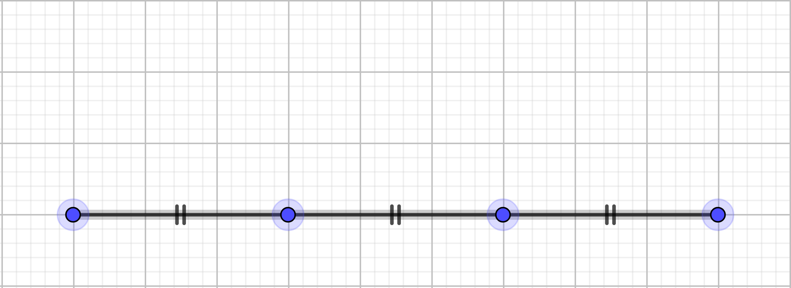
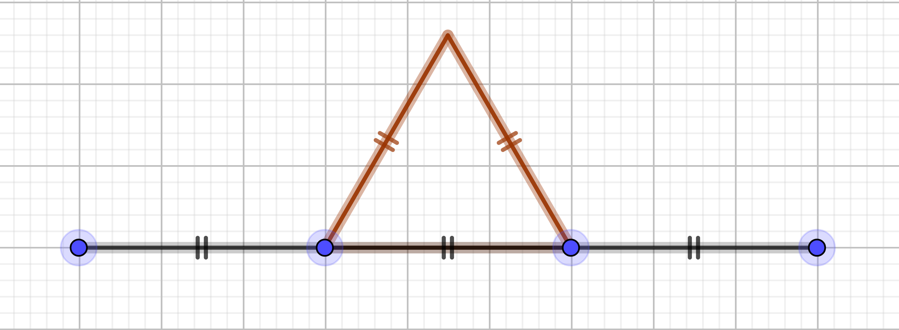





{{ titre_chapitre(num,titre,theme)}}
 
## Activités 

{{ titre_activite("A la découverte de la récursivité",[],0) }}

1. Ecrire un programme Python permettant de tracer la spirale de carré suivante sachant que :
    * Le côté du grand carré initial mesure 200 pixels
    * Le coin inférieur gauche des carrés est l'origine du repère
    * A chaque étape les carrés tournent de 20°
    * A chaque étape la côté du carré diminue de 10% de sa longueur.
    * On interrompt la construction lorsque la taille est inférieure ou égale à 10 pixels

    {: .imgcentre}

2. Pour réaliser le dessin ci-dessus vous avez probablement utilisé une boucle, votre programme est dit **itératif**. Remarquons à présent que cette spirale peut se décomposer en un premier carré (en trait épais ci dessous), suivi d'une spirale de carrés (en gris et traits fin ci-dessous) :
{: .imgcentre}
On pourrait donc définir qu'une spirale est constituée (compléter):

    * :one: d'un .....
    * :two: et d'une ........... plus petite !

    La particularité de ce type de définition est de faire appel à elle-même, on, dit qu'elle est **récursive**.

1.  Construction récursive d'une spirale.
    1. En utilisant la définition précédente, compléter le code de la fonction Python suivant :
    ```python
        def spirale_recursive(tortue,taille):
            # Un carré
            carre(tortue,taille)
            # Et une spirale plus petite
            tortue.left(....)
            taille = .......
            spirale_recursive(tortue,taille)
            
    ```
    2. Quelle est la particularité de cette fonction ?
    3. Que se passe-t-il à l'exécution ? Pourquoi ?
    4. Modifier la définition de cette fonction en introduisant la condition d'arrêt (`taille<=10`)

2. Proposer une définition récursive d'un escalier, en déduire une construction récursive de la figure suivante :
{: .imgcentre}

{{ titre_activite("D'autres exemples de récursivité",[]) }}

1. Somme des `n` premiers entiers
    1. Ecrire une fonction python `somme(n)` itérative qui calcule la somme des `n` premiers entiers. Par exemple `somme(5)` renvoie `15` puisque `1+2+3+4+5=15`.
    2. Compléter l'égalité mathématique suivante entre `somme(n)` et `somme(n-1)` : <br>
        `somme(n) = somme(n-1) + ... `
    3. En déduire une version récursive de la fonction `somme(n)`

2. Écrire à l'envers
    1. Compléter puis tester le code de la fonction Python ci-dessous qui prend en argument une chaine de caractère et la renvoie écrite à l'envers
    ```python
    def envers(chaine):
    resultat = ""
    for caractere in .....:
        resultat = ...... + resultat
    return .....
    ```
    2. On décompose une `chaine` en `chaine = debut + dernier caractère`, compléter la définition récursive suivante :
    `envers(chaine) = .......... + envers(.......)`

    3. En déduire une version récursive de la fonction `envers`

        !!! Aide
            On pourra écrire au préalable une fonction `debut(chaine)` qui renvoie la chaine privée de son dernier caractère. On rapelle que le dernier caractère de `chaine` s'obtient avec `chaine[-1]`.
    


{{ titre_activite("Soulever le capot de la récursivité",[]) }}

1. Se rendre sur le site [Python tutor](http://www.pythontutor.com/visualize.html){target=_blank}, un outil en ligne permettant de visualiser le fonctionnement d'un programme Python. Laisser les options par défaut à l'exception de `inline primitives don't nest objects [default]` ) à remplacer par `render all objects on the heap (Python/Java)` comme ci-dessous :
{: .imgcentre}
2. Entrer sur Python tutor le code de fonction `somme(n)` itérative, qu'on teste avec `n=5` :
```python
def somme(n):
    s = 0
    for i in range(n):
        s+=i
    return s

test = somme(5)
```
    Suivre l'exécution pas à pas du calcul.

3. Faire de même mais avec la fonction `somme_recursive(n)` :
```python
def somme_recursive(n):
    if n==0: 
        return 0
    else:
        return n + somme_recursive(n-1)

test =  somme_recursive(5)
```
4. La figure suivante représente une étape de l'exécution. Comment expliquer que les entiers sont "stockés" à droite mais qu'aucun calcul n'a encore été effectué ?
{: .imgcentre}
5. La colonne de droite où sont stockés les entiers s'appelle une **pile**, (*heap* en anglais). La taille maximale de cette pile est la profondeur maximale de récursion (*recursion depth*). Quitter Python Tutor et tester la fonction `somme_recursive` avec une valeur élevée de `n` (par exemple `n=3000`). Que se passe-t-il ? Expliquer.
6. La version itérative est-elle concernée par ce problème ?

## Cours

{{ aff_cours(num) }}

## Exercices

{{ exo("Factorielle",["maths"],0) }}
En mathématiques, on appel *factorielle* d'un entier $n$ et on $n!$ le produit de cet entier par tous ceux qui le précèdent à l'exception de zéro. On convient d'autre part que $0!=1$.  Par exemple, <br>
$5! =  5 \times 4 \times 3 \times 2 \times 1 = 120$.

1. Programmer une version itérative d'une fonction `factorielle(n)` qui renvoie factorielle de l'entier positif `n` passé en argument.
2. Recopier et compléter : <br>
$n! = n\times \underbrace{(n-1) \times \dots \times 1}_{...}$ <br>
$n! = n \times \dots$
3. En déduire une version récursive de la fonction `factorielle(n)`.


{{ exo("Analyser un programme récursif",[]) }}


On considère la fonction `mystere` ci-dessous :
```python
def mystere(liste):
    if len(liste)==1:
        return liste[0]
    else:
        if liste[0]<liste[1]:
            liste.pop(1)
        else:
            liste.pop(0)
        return mystere(liste)
```

1. Analyser ce programme, en déduire le rôle de cette fonction.

    !!! aide 
        Faire fonctionner "à la main" ce programme sur une liste de petite taille, revoir le rôle de `pop` si nécessaire.

2. Donner une version itérative de cette fonction

{{ exo("Comprendre un programme récursif",[]) }}

On donne le code incomplet d'une fonction récursive permettant de calculer le produit de deux entiers positifs `a` et `b` en effectuant uniquement des additions :
```python
def produit(a,b):
    if b==...:
        return ...
    else:
        return ...+produit(...,...)
```

1. Compléter les égalités suivantes :
    * $a \times 0 = \dots$
    * $a \times b = a + a \times (\dots  \dots)$
2. Compléter le code de la fonction ci-dessus et la tester
3. Que se passe-t-il si on choisit une valeur assez grande pour `b`, par exemple 5000 ? Pourquoi ? En est-il de même pour de grandes valeurs de `a` ? Pourquoi ?
4. Améliorer le code de cette fonction de façon à ce que le dépassement de pile de récursion n'arrive que lorsque `a` et `b` sont tous deux supérieurs à la taille maximale.

{{ exo("Additions et soustractions",[]) }}
On suppose qu'on ne dispose que de deux opérations : ajouter 1 ou retrancher 1.

1. Écrire à l'aide de ces deux opérations, une version itérative de l'addition de deux entiers.
2. Même question avec une version itérative.

{{ exo("Dessin récursif",[]) }}

1. Dessiner une suite de carré imbriqués comme ci-dessous (la carré initial mesure 200 pixels et diminue de 20 pixels à chaque carré suivant)
{: .imgcentre}
2. Si vous aviez donné une version itérative de ce dessin, en faire une version récursive et inversement.

{{ exo("Comparaison de deux chaines de caractères",[]) }}

1. Ecrire de façon itérative, une fonction `compare(chaine1,chaine2)` qui renvoie le nombre de fois où `chaine1`  et `chaine2` ont le même caractère au même emplacement. A titre d'exemples : 

    * `compare("recursif","iteratif")` renvoie 2, 
    * `compare("Python","Javascript")` renvoie 0. 

2. Écrire cette même fonction de façon récursive.

    !!! aide
        Vous aurez peut être besoin d'une fonction `reste(chaine)` qui renvoie la chaine passée en paramètre privée de son premier élément. Par exemple `reste("python")` renvoie `ython`. Ecrire vous même cette fonction, ou chercher comment utiliser les *slices* de Python.

{{ exo("Mélange d'une liste ",["bac"]) }}
*Cet exercice est extrait d'un sujet de {{sc("bac")}} de la session 2021*

On s'intéresse dans cet exercice à un algorithme de mélange des éléments d'une liste.

1. Pour la suite, il sera utile de disposer d'une fonction `echange` qui permet d'échanger dans une liste lst les éléments d'indice i1 et i2.
Expliquer pourquoi le code Python ci-dessous ne réalise pas cet échange et en proposer une modification.
```python
    def echange(lst, i1, i2):
        lst[i2] = lst[i1]
        lst[i1] = lst[i2]
```
2. La documentation du module random de Python fournit les informations ci-dessous concernant la fonction randint(a,b) : 
    
    > `Renvoie un entier aléatoire N tel que a <= N <= b. Alias pour randrange(a,b+1).`

    Parmi les valeurs ci-dessous, quelles sont celles qui peuvent être renvoyées par
    l'appel `randint(0, 10) ?` <br>
    0 &nbsp; &nbsp; &nbsp;&nbsp; 1 &nbsp; &nbsp; &nbsp;&nbsp; 3.5&nbsp; &nbsp; &nbsp;&nbsp; 9&nbsp; &nbsp; &nbsp;&nbsp;10&nbsp; &nbsp;&nbsp; &nbsp;11

3. Le mélange de Fischer Yates est un algorithme permettant de permuter aléatoirement les éléments d'une liste. On donne ci-dessous une mise en œuvre récursive de cet algorithme en Python.
```python
from random import randint
def melange(lst, ind):
    print(lst)
    if ind > 0:
    j = randint(0, ind)
    echange(lst, ind, j)
    melange(lst, ind-1)
```
    1. Expliquer pourquoi la fonction `melange` se termine toujours.
    2. Lors de l’appel de la fonction melange, la valeur du paramètre `ind` doit être égal au plus grand indice possible de la liste `lst`. Pour une liste de longueur `n`, quel est le nombre d'appels récursifs de la fonction melange effectués, sans compter l’appel initial ?
    3. On considère le script ci-dessous :

        ```python
            lst=[v for v in range(5)]
            melange(lst,4)
        ```

        On suppose que les valeurs successivement renvoyées par la fonction `randint` sont `2, 1, 2` et `0`.
        Les deux premiers affichages produits par l'instruction `print(lst)` de la fonction `melange` sont : <br>
        `[0,1,2,3,4]`<br>
        `[0,1,4,3,2]`<br>
        Donner les affichages suivants produits par la fonction `melange`
        
    4. Proposer une version itérative du mélange de Fischer Yates.


{{ exo("Recherche dichotomique dans un tableau trié",["rappel"]) }}

1. Rappeler l'algorithme de recherche dichotomique dans un tableau trié vu en classe de première et donner son fonctionnement sur un exemple simple.
    
    !!! aide
        Voir [cette page](https://fabricenativel.github.io/NSIPremiere/notionsalgo/#activite-2-recherche-dichotomique){taget=_blank} du cours de première.

2. Coder cet algorithme de façon itérative
3. Coder cet algorithme de façon récursive

{{ exo("Flocon de Von Koch",["dur"]) }}

La courbe de Koch est une figure qui se construit de manière récursive.  Le cas de base (ordre 0) s'obtient en traçant un segment de longueur $l$. Le cas récursif d'ordre $n>0$ s'obtient en effectuant les transformations suivantes  :

|Etape | Illustration | Commentaire |
|------|--------------|-------------|
|:one: |{width=400px} | Partager le segment en trois morceaux de longueur égale |
|:two: |{width=400px} | Construire un triangle équilatéral à partir du segment du milieu |
|:three: |{width=400px} | Supprimer le segment du milieu |

On a écrit une fonction `courbe_koch` permettant de tracer à l'aide du module turtle de Python la courbe de Koch  en donnant en paramètre la longueur initiale du segment et l'ordre. On donne ci-dessous ce code incomplet : 
```python
def courbe_koch(tortue,longueur,ordre):
    if ........
        ........
    else:
        ordre=........
        longueur=........
        courbe_koch(tortue,longueur,ordre)
        .................
        courbe_koch(tortue,longueur,ordre)
        ................
        courbe_koch(tortue,longueur,ordre)
        ................
        courbe_koch(tortue,longueur,ordre)
```

1. Compléter et tester ce code pour tracer une courbe de Koch d'ordre 4. Vous devriez obtenir une figure similaire à celle représentée ci-dessous : 
{: .imgcentre}
2. En utilisant cette fonction construire le [flocon de Koch](https://fr.wikipedia.org/wiki/Flocon_de_Koch){target=_blank}, c'est à dire la figure obtenu en construisant les courbe de Koch sur les trois côtés d'un triangle équilatéral. 
3. Le flocon de Koch est un exemple classique de courbe *fractale*, construire un autre exemple de fractale : [le triangle de Sierpinski](https://fr.wikipedia.org/wiki/Triangle_de_Sierpi%C5%84ski){target=_blank}.

{{ exo("Les tours de Hanoï",[]) }}
Inventé par le mathématicien français [Edouard Lucas](https://fr.wikipedia.org/wiki/%C3%89douard_Lucas){target=_blank},  [les tours de Hanoï](https://fr.wikipedia.org/wiki/Tours_de_Hano%C3%AF){target=_blank} sont un jeu de réflexion dans lequel on doit déplacer des disques de tailles croissantes d'une tour de départ à une tour d'arrivée en respectant les contraintes suivantes : <br>
:octicons-triangle-right-16: on ne peut déplacer qu'un disque à la fois, celui situé en haut de la tour <br>
:octicons-triangle-right-16: on ne peut jamais déplacer un disque sur un disque plus petit.<br>

1. Faire quelques parties en ligne à [cette adresse](http://championmath.free.fr/tourhanoi.htm){target=_blank} pour comprendre le jeu.
2. Module `hanoi.py`
    1. Télécharger ci-dessous le module Python `Hanoi.py` et le sauver dans le répertoire de votre choix.
    {{ telecharger("Module Hanoi","./files/C1/hanoi.py")}} 
    2. Ce module propose les fonctions suivantes : <br>
        :octicons-triangle-right-16: `dessine_depart(n)` qui dessine l'état de départ du jeu avec `n` disques.<br>
        :octicons-triangle-right-16: `fin()` affiche dans la fenêtre "Cliquer pour terminer" et termine le programme après un clic.<br>
        :octicons-triangle-right-16: `deplace_disque(depart,arrive)` déplace le disque de la tour `depart` à la tour `arrivee` si cela est possible (sinon affiche un message d'erreur).<br>
        On donne ci-dessous un exemple d'utilisation de ce module, le compléter de façon à afficher la résolution complète du jeu avec 3 disques.
        ```python
            import hanoi

            hanoi.dessine_depart(3)
            hanoi.deplace_disque(1,3)
            hanoi.fin()
        ```
3. Résolution automatique par récursivité
    1. Compléter la description de chacune des étapes de la résolution du problème pour 6 disques illustrées ci-dessous :

    |Etape | Illustration | Descriptions |
    |------|--------------|--------------|
    |:zero:|| 6 disques empilés sur la tour 1|
    |:one:|| Déplacement de ... disques de la tour 1 vers la tour ....|
    |:two:|| Déplacement du disque de la tour ... vers la tour ...|
    |:three:|| Déplacement de ... disques de la tour 1 vers la tour ....|

    2. Exprimer les étapes 1 et 3 sous la forme de la résolution d'un problème de tours de Hanoi dont on précisera la tour d'arrivée, la tour de départ ainsi que le nombre de disque.
    3. Compléter :

        > Pour résoudre `hanoi` à 6 disques :<br>
        :octicons-triangle-right-16: Résoudre hanoi à ... disques <br>
        :octicons-triangle-right-16: Déplacer le disque de taille 6<br>
        :octicons-triangle-right-16: Résoudre hanoi à ... disques <br>


    3. En déduire un algorithme récursif pour résoudre le problème des tours de Hanoï.
    4. Coder et faire fonctionner cet algorithme à l'aide des fonctions présentes dans le module `hanoi.py`.

{{ exo("Algorithme d'Euclide de calcul du pgcd",["rappel","maths"]) }}
1. Faites des recherches sur [l'algorithme d'Euclide](https://fr.wikipedia.org/wiki/Algorithme_d%27Euclide){target=_blank}.
    1. Que permet de faire cet algorithme ?
    2. Faire fonctionner cet algorithme à la main avec les valeurs suivantes en donnant les étapes:
        * $a=48$ et $b=36$
        * $a=13$ et $b=9$
2. Rappeler les instructions Python permettant d'obtenir le reste et le quotient d'une division euclidienne.
3. Donner une implémentation itérative de cet algorithme
4. Donner une implémentation récursive de cet algorithme

{{ exo("Suite de Fibonnaci",["maths"]) }}

La suite de Fibonnaci $(f_n)$ est définie par :

$$\left\{ \begin{array}{lll} 
f_0&=&0, \\
f_1&=&1, \\
f_{n}&=&f_{n-1}+f_{n-2} \mathrm{\ \ pour\ tout\ \ } n\geq2. \end{array} \right.$$

 C'est à dire que chaque terme de la suite est la somme des deux précédents.

1. Calculer à la main les premières valeurs de cette suite en complétant le tableau suivant :

    <table>
    <tr> <td>\(\textcolor{darkred}{n}\)</td> <td>0</td> <td>1</td> <td>\(\dots\)</td> <td>\(\dots\)</td> <td>\(\dots\)</td> <td>\(\dots\)</td> <td>\(\dots\)</td> <td>\(\dots\)</td>  </tr>
    <tr> <td>\(\textcolor{darkred}{f_n}\)</td> <td>0</td> <td>1</td> <td>\(\dots\)</td> <td>\(\dots\)</td> <td>\(\dots\)</td> <td>\(\dots\)</td> <td>\(\dots\)</td> <td>\(\dots\)</td>  </tr>
    </table>

2. Compléter le code suivant permettant de calculer les termes de cette suite :

    ```python
        def fibonnaci(n):
            if n<2:
                return ....
            else:
                return ........+............
    ```

3. Tester cette fonction en écrivant une boucle qui écrit les termes de la suite de Fibonnaci pour les entiers de 1 à 50. 
4. Que remarquez-vous ?
5. Recopier et compléter le schéma suivant qui montre les appels récursifs nécessaires au calcul de $f_5$.

    ```mermaid
                graph TD
                f5[f5] --> f4[f4]
                f5 --> f3[f3]
                f4 --> f32[f3]
                f4 --> f2[...]
                f3 --> f33[...]
                f3 --> f34[...]
    ```

6. En déduire une explication de la lenteur observée à la question 4.

7. Proposer une version itérative du calcul du énième terme de la suite de Fibonnaci.

!!! lien "Pour aller plus loin"
    La vidéo suivante (en anglais) reprend ce problème et propose une solution pour coder un algorithme plus efficace
    <div class="centre"><iframe width="560" height="315" src="https://www.youtube.com/embed/Qk0zUZW-U_M" title="YouTube video player" frameborder="0" allow="accelerometer; autoplay; clipboard-write; encrypted-media; gyroscope; picture-in-picture" allowfullscreen></iframe></div>
