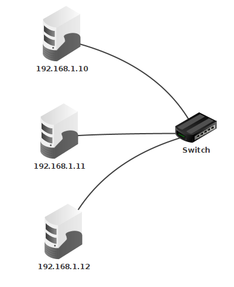
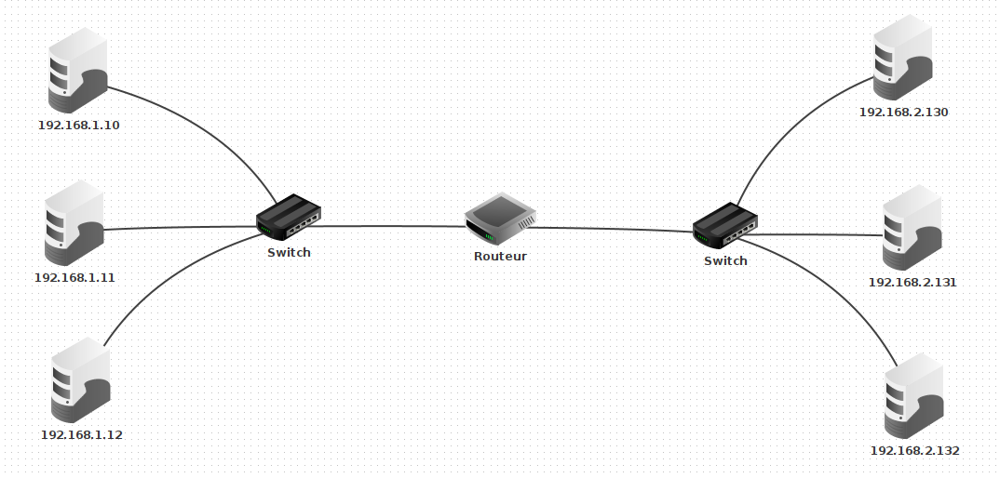




{{ titre_chapitre(num,titre,theme)}}

!!! Attention
    Avant de commencer ce chapitre, revoir les notions de [réseau vues en classe de première](https://fabricenativel.github.io/NSIPremiere/reseau/){target = _blank}. En, particulier :

    * consulter l'activité 1 pour une initiation à l'utilisation du [logiciel de simulation de réseau filius](https://fabricenativel.github.io/NSIPremiere/reseau/#activite-1-simuler-un-reseau-avec-filius){target=_blank},
    * les notions d'adresses {{sc("ip")}},
    * le [diaporama de cours de ce chapitre](https://fabricenativel.github.io/NSIPremiere/reseau/#cours){target=_blank}.

    Ne pas hésiter à consulter d'autres ressources sur le *Web* :

    * [Le chapitre réseau](https://dav74.github.io/site_nsi_prem/c16c/){target=_blank} du cours de première sur le site pixees.
    * [Video Lumni](https://www.lumni.fr/video/l-architecture-des-reseaux-et-les-protocoles-de-communications){target=_blank}
    * [Cours du lycée duparc](https://frederic-junier.gitlab.io/parc-nsi/chapitre25/reseau-cours-git/){target=_blank}
## Activités 


{{ titre_activite("Adresse IP, masque",[],0) }}

!!! rappel
    Deux machines ne peuvent communiquer que si elles sont sur le même réseau, c'est à dire que leurs adresses {{sc("ip")}} démarre par une partie commune. La longueur de cette partie commune est définie par le **masque de sous réseau**. Pour la connaître, on écrit le masque de sous réseau en binaire. Le nombre de 1 en début de masque donne la longueur de la partie commune dans les adresses IP. Par exemple  le masque `255.255.254.0` donne en écriture binaire `11111111.11111111.111111110.00000000`. La partie commune doit donc être de 23 bits car cette écriture débute par 23 fois le chiffre `1`. Un masque de 23 bits peut se noter de façon plus concise `/23` (notation {{sc("cidr")}}). Pour savoir si deux machines de ce réseau peuvent communiquer on écrit leurs adresses IP en binaire et on regarde si les 23 premiers bits sont identiques ou non.

!!! rappel
        l'adresse du réseau s'obtient en réalisant un *et* logique entre l'adresse IP d'un ordinateur du réseau et le masque de sous réseau.

1. Lancer [Filius](https://www.lernsoftware-filius.de/), un outil de simulation de réseaux, et crée un simple réseau constitué de deux ordinateurs. Dans chacun des cas suivants, prévoir si les deux ordinateurs peuvent communiquer et le vérifier à l'aide d'une commande `ping`
    
    | IP ordinateur 1 | Masque Ordinateur 1 | IP ordinateur 2 | Masque ordinateur 2|
    |-----------------|---------------------|-----------------|--------------------|
    | 203.147.154.100 | 255.255.255.192     | 203.147.154.119 |  255.255.255.192   |
    | 203.147.154.100 | 255.255.255.192     | 203.147.154.129 |  255.255.255.192   |
    | 172.19.247.15   | 255.255.240.0       | 172.19.230.150  |  255.255.240.0     |
    | 172.19.247.15   | 255.255.240.0       | 172.19.248.118  |  255.255.240.0     | 

    !!! aide
        En cas de difficultés pour utiliser Filius, faire la [première activité du cours de première](https://fabricenativel.github.io/NSIPremiere/reseau/#activite-1-simuler-un-reseau-avec-filius){target=_blank}.

2. Un *switch* sert à connecter plusieurs ordinateurs d'un même sous réseau, ainsi chez un particulier, une box internet joue le rôle de switch et permet de connecter les divers appareils de la maison (téléphone, ordinateur, imprimante, ...). Connecter trois ordinateurs au même sous réseau comme ci-dessous et vérifier à l'aide de la commande `ping` qu'ils peuvent communiquer.
{width=200px .imgcentre}

3. Un *routeur* permet d'interconnecter plusieurs sous réseau. Réaliser dans filius le réseau ci-dessous (le routeur a deux interfaces). Attribuer les mêmes adresses {{sc("ip")}} que sur le schéma et remarquer bien que les ordinateurs de droite et de gauche ne font pas partie du même sous réseau. C'est le routeur qui permet leur interconnection, pour cela il faut indiquer pour chaque machine du réseau de gauche l'adresse du routeur dans le champ passerelle et faire de même, pour chaque machine du sous réseau de droite.
{width=460px .imgcentre}

    !!! aide
        En cas de difficultés, se référer à la vidéo suivante :
        <div class="centre">
        <iframe width="560" height="315" src="https://www.youtube.com/embed/xyK6ThdQeR0" title="YouTube video player" frameborder="0" allow="accelerometer; autoplay; clipboard-write; encrypted-media; gyroscope; picture-in-picture" allowfullscreen></iframe>
        </div>

{{ titre_activite("Protocoles de routage",[]) }}

On peut assimiler un réseau à un graphe, les noeuds sont les routeurs et les arcs les liaisons entre ces routeurs. Par exemple :
<div class="centre">
            ```mermaid
            graph TD
            A(("A"))
            B(("B"))
            C(("C"))
            D(("D"))
            E(("E"))
            A --- B
            A --- E
            B --- E
            B --- D
            C --- E
            C --- D
            ```
</div>
Dans cet exemple, plusieurs chemins permettent de relier `A` à `C`. Un *protocole de routage* est un mécanisme permettant de choisir l'un de ces chemins. Pour mettre en place un protocole de routage, chaque routeur doit être doté d'une *table de routage* qui indique le routeur suivant selon la destination du paquet.

1.  Le protocole {{sc("rip")}} : **R**outing **I**nformation **P**rotocol

    1.  Sachant que dans ce protocole, on tente de minimiser le  nombre de routeurs traversés, quel serait les chemins empruntés pour :

        1.  relier `A` et `E` ?
        2.  relier `A` et `C` ?
        3.  relier `E` et `D` ?

    2.  De plus dans ce protocole, à l'initialisation, la table de routage de chaque routeur ne contient que ses voisins immédiats associés à une distance de 1. Par exemple la table de routage de `A` est :

        | Destination | Distance |
        |:-------------:|:----------:|
        | B | 1 |
        | E | 1 |

        et celle de `B` est :

        | Destination | Distance |
        |:-------------:|:----------:|
        | A | 1 |
        | D | 1 |
        | E | 1 |


        Donner à l'initialisation, les tables de routages des autres routeurs : `C`, `D` et `E`.
    
    3. Les tables de routages sont mises à jour à intervalles réguliers, en effet chaque routeur consulte la table de routage de ses voisins et met la sienne à jour en conséquence. Par exemple, `A` reçoit la table de routage de `B`, il y trouve `D` qui ne figure pas encore dans sa table et le rajoute donc en augmentant sa distance de 1. La table de `A` devient donc :

        | Destination | Distance |
        |:-------------:|:----------:|
        | B | 1 |
        | E | 1 |
        | D (via B) | 2 |
        
        Le routeur `E` figure déjà dans la table avec une distance plus courte, il n'est pas mis à jour.
        Construire la table de routage de `B` après la première mise à jour.

2.  Le protocole {{sc("ospf")}}  
    La qualité des liaisons entre différents routeurs dépend du type de connection, on peut donc représenter un réseau par un graphe pondéré. Dans l'exemple suivant, la qualité de la liason entre `A` et `E` (poids 1) est bien meilleure que celle entre `A` et `B` (poids 5) 
    <div class="centre">
                ```mermaid
                graph TD
                A(("A"))
                B(("B"))
                C(("C"))
                D(("D"))
                E(("E"))
                A-- 5 ---B
                A-- 1 --- E
                B-- 2 --- E
                B-- 2 --- D
                C-- 1 --- E
                C-- 4 --- D
                ```
    </div>

    1.  Sachant que dans ce protocole, on tente de minimiser le poids du chemin parcouru, quel serait les chemins empruntés pour :

        1.  relier `A` et `E` ?
        2.  relier `A` et `C` ?
        3.  relier `E` et `D` ?

## Cours

{{ aff_cours(num) }}


## Exercices

{{ exo("....",[],0) }}

