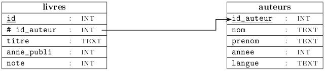




{{ titre_chapitre(num,titre,theme)}}
 
## Activités 
{{ titre_activite("Rappels de SQL",[],0) }}

1. Commencer par télécharger et sauvegarder la base de données de livres suivante :
    {{ telecharger("Livres","files/C9/livres.db")}}
Cette base provient de [pixees](https://pixees.fr/informatiquelycee/term/c2.html){target=_blank}
2. Quelques rappels sur les bases de données
    1. Lancer SQLite et ouvrir la base de données `livres.db` (qui contient une unique table livres). Rappeler la signification du vocabulaire suivant : *enregistrement*, *attribut*. Que sont les enregistrements dans le cas de cette table ?
    2. De quel type est l'attribut `note` ? Proposer un domaine pour cet attribut.
    3. Rappeler le principe d'unicité, quel attribut sert de clé primaire ?

3. Quelques rappels sur le {{ sc("sql")}}
    1. Ecrire une requête permettant de lister tous les livres ayant obtenu une note de 10.
    2. Ecrire une requête permettant de lister les livres dans l'ordre alphabétique de leur titre.
    3. Ecrire une requête permettant de savoir combien d'auteurs différents apparaissent dans cette base de données.
    3. Ecrire une requete permettant de calculer la moyenne des notes attribuées aux livres écrits par René Barjavel.

4. Du nouveau en {{ sc("sql") }} 

    Nous n'avons pour le moment vu que l'instruction {{sc('select')}} qui permet de sélectionner des données, le langage {{ sc("sql") }}permet aussi :

    * d'ajouter des données dans une table avec {{ sc("insert") }},
    * de modifier des données dans une table avec {{ sc("update") }},
    * de supprimer des données dans une table avec {{ sc("delete") }}.

        1. Faire vous même des recherches sur le *web* pour comprendre la syntaxe d'une requête d'insertion, puis ajouter dans cette table l'enregistrement correspondant au livre *"la planète des singes"* écrit par Pierre Boulle en francais et publié en 1963. On laisse pour le moment vide le champ `note`. 

            !!!aide 
                Respecter bien le type des attributs et ne pas oublier pas l'attribut `id`

        2. Rechercher aussi la syntaxe d'un {{ sc("sql") }} puis modifier l'enregistrement précédent en mettant une note de 10.

            !!!aide 
                Utiliser l'attribut `id` pour repérer l'enregistrement à modifier

        3. Rechercher enfin la syntaxe d'un {{ sc("delete")}}, le tester en ajoutant puis supprimant un enregistrement de votre choix.

5. Vers l'utilisation de plusieurs tables
On appelle *schéma relationnel* l'ensemble des relations (ou tables) présentes dans une base de données. On représente généralement une table d'un schéma relationnel en indiquant chaque attribut, la clé primaire étant souligné. Le schéma de notre base est donc :   
**livres** (^^id^^, titre, nom_auteur, prenom_auteur, annee_auteur, langue_auteur, annee_publi, note) 
Des représentation en tableau sont parfois plus lisibles :
{: .imgcentre}

    1. De nombreuses informations sont dupliquées dans notre base de données, lesquelles ?
    2. Quels sont les inconvénients de cette duplication d'information ?
    3. On propose de créer une nouvelle table **auteurs** qui contiendra les informations sur les auteurs, proposer un schéma pour cette table.
    4. La table des livres s'en trouve allégée, on y enlève les informations concernant l'auteur et on ajoute un champ `id_auteur` qui référence un élément de la table des auteurs. On dit que `id_auteur` est une *clef étrangère*, c'est à dire la clé primaire d'une autre table, dans le schéma relationnel on note ce champ en le faisant précédé d'un `#`. Ecrire le schéma relationnel de cette nouvelle base de données.

{{ titre_activite("Plusieurs tables",[]) }}
On reprend la base de données livres contenant maintenant deux tables et construite à l'activité précédente :
    {{ telecharger("Livres avec table auteur","files/C9/livres_auteurs.db")}}
Le schéma relationnel de cette base de données est donné ci-dessous :
{: .imgcentre}

1. Intégrité référentielle

    1. Rappeler rapidement la signification des attributs soulignés et du caractère `#`.
    2. On considère la requête suivante :
    ```sql
    DELETE FROM auteurs WHERE id_auteur=10
    ```
    quel devrait être l'effet de cette requête sur la base de données ? Tester cette requête, que se passe-t-il ?
    3. Même question pour la requête  : 
    ```sql
    INSERT INTO  livres  VALUES (17,11,"Harry potter",1997,6)
    ```
    4. Ces requêtes échouent car le {{sc("sgbd")}} préserve de façon automatique l'*intégrité référentielle* schématisé par la flèche dans le schéma relationnel ci-dessus. En faisant éventuellement des recherches sur le web, donner une définition de l'intégrité référentielle.

2. Requête dans plusieurs tables
On désire maintenant lister tous les titres de livres présents dans notre base de données accompagnés du nom de leur auteur. On doit donc effectuer une requête *sur plusieurs tables* puisque les titres sont dans la table des **livres** et les noms d'auteurs dans la table **auteurs**

    !!!danger
        Les attributs de deux tables peuvent avoir le même nom, par exemple ici `id_auteur` est un attribut de **livres** et aussi de  **auteurs**. On prendra donc l'habitude pour éviter toute ambiguïté de préfixé l'attribut par le nom de sa table. Ici, on a donc les attributes `livres.id_auteur` et `auteur.id_auteur`. 

    1. Tester la requête suivante, dans laquelle on a préfixé les attributs par le nom des tables : 

        ```sql
        SELECT livres.titre, auteur.nom FROM livres,auteur
        ```
    Le résultat est-il celui attendu ?

    2. On doit effectuer ce qu'on appelle une *jointure* c'est à dire indiquer qu'on associe le livre et l'auteur lorsque le champ `id_auteur` des deux tables correspond. La syntaxe est la suivante : 

        ```sql
        SELECT livres.titre, auteur.nom FROM livres JOIN auteurs ON 
        ivres.id_auteur = auteur.id_auteur
        ```
    Tester cette requête.

    3. Ecrire une requête permettant de lister tous les titres de livres avec nom et prénom de l'auteur lorsque les auteurs sont nés en 1920.

3. A vous de jouer !   
Télécharger la base de données `bibliotheque` :
{{ telecharger("Bibliotheque","files/C9/bibliotheque.db")}}
 on y trouve les deux tables des questions précédentes et deux nouvelles tables : **clients** et **emprunts**.

    1. Donner le schéma relationnel de cette base de données en y faisant figurer les clés primaires et étrangères. 

        !!!aide
            Faire le schéma sous la forme d'un schéma comme au début de cette activité en y ajoutant les deux tables **clients** et **emprunts**.

    2. Expliquer rapidement les relations préservées par l'intégrité référentielle de cette base de données en donnant un exemple de requête qui renverrait une erreur de type `foreign key  constraint failed`.

    3. Ajouter un enregistrement de votre choix dans la table **clients**.

    4. Ajouter un enregistrement pour le client de la question précédente dans la table des **emprunts**.

    5. Ecrire une requête permettant de lister tous les emprunts en cours dans cette bibliothèque avec le nom de l'emprunteur et le titre du livre.


{{ titre_activite("Une enquête policière avec SQL",[]) }}

Le but de cette activité, proposé sur le site de l'université américaine  [Northwerstern University](https://knightlab.northwestern.edu/){target=_blank} est de résoudre un crime en utilisant des requêtes SQL dans une base de données dont voici le schéma relationnel :
{: .imgcentre}

Toutes les requêtes peuvent être exécutées directement sur le site, cependant vous pouvez télécharger ci-dessous la base afin d'exécuter vos requêtes en local :
{{ telecharger("SQL Murder Mystery","./files/C9/sql-murder-mystery.db")}}

Cliquer sur l'image ci-dessous pour accéder à l'enquête et trouver le coupable.
[{: .imgcentre}](https://mystery.knightlab.com/walkthrough.html){target=_blank}


## Cours

{{ aff_cours(num) }}


## Exercices

{{ exo("Exercices corrigés en ligne",[],0)}}

Le site du [CNAM](http://deptfod.cnam.fr/bd/tp){target=_blank} propose de vous entraîner aux requêtes SQL sur quatre base de données (films, voyageurs, immeubles et messagerie). Pour chaque base, des requêtes sont suggérés et la correction est proposée.


{{ exo("Métropole candidat libres 2021 Sujet 1- Exercice 1",["bac"]) }}

{{telecharger("Enoncé","./pdf/C9/Metropole2021CL-1ex1.pdf")}}

{{ exo("Métropole candidat libres 2021 Sujet 2- Exercice 1",["bac"],0) }}

{{telecharger("Enoncé","./pdf/C9/Metropole2021CL-2ex1.pdf")}}

{{ exo("Amérique du nord 2021 - Exercice 1",["bac"]) }}

{{telecharger("Enoncé","./pdf/C9/AmeriqueNord2021ex1.pdf")}}