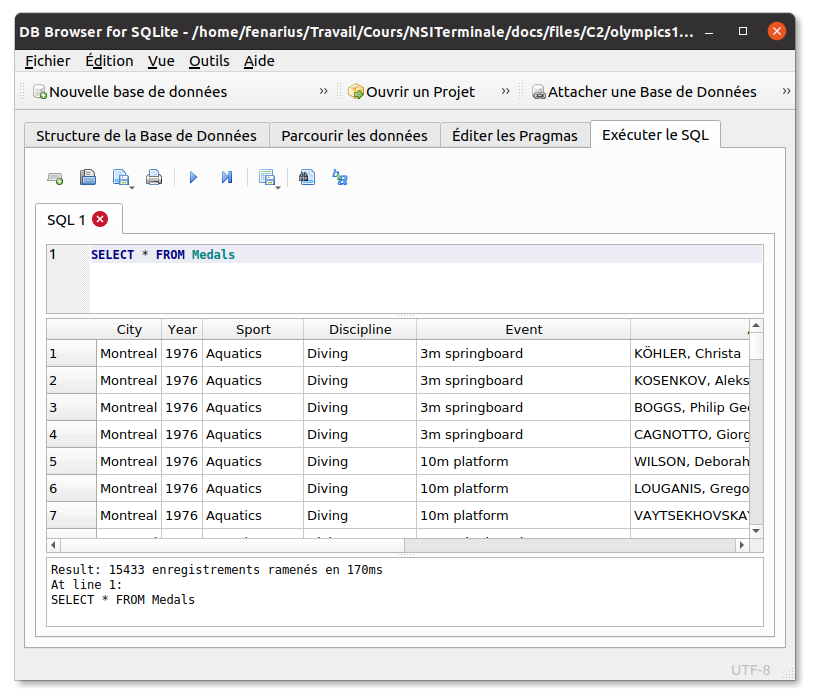
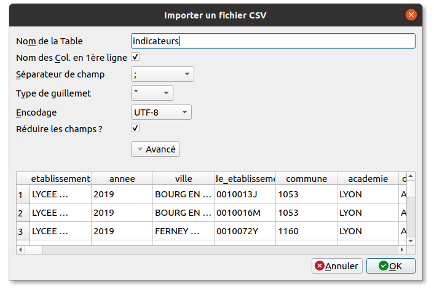





{{ titre_chapitre(num,titre,theme)}}
 
## Activités  

{{ titre_activite("Un peu d'histoire et de théorie",["video"],0) }}

<div class="centre"><iframe width="560" height="315" src="https://www.youtube.com/embed/pqoIBiM2AvE" title="YouTube video player" frameborder="0" allow="accelerometer; autoplay; clipboard-write; encrypted-media; gyroscope; picture-in-picture" allowfullscreen></iframe></div>

En utilisant la vidéo ci-dessus et en faisant vos propres recherches sur le *Web*, répondre aux questions suivantes :

1. Quel mathématicien est à l'origine de la théorie des bases de données ? En quelle année ?
2. Avant l'avènement des bases de données, les données étaient stockés sous la forme de simples fichiers, quels étaient les inconvénients de ce fonctionnement ?
3. Que signifie l'*absence de redondance* pour une base de données ?
4. Que signifie l'*indépendance logique* pour une base de données ?
5. Que signifie l'*intégrité* pour une base de données ?
6. Donner les noms de quelques {{ sc("sgbd") }} connus en indiquant s'il s'agit de logiciels libres ou propriétaires.


!!! Remarques
        * Le {{ sc("sgbd" ) }} utilisé dans le cadre de ce cours est [sqlite](https://www.sqlite.org/index.html){target=_blank}, accompagné de son interface graphique [DB Browser for sqlite](https://sqlitebrowser.org/){target=_blank}. Ces logiciels sont libres, gratuits et multiplateformes.
        * La création de base de données ne figurant pas au programme de NSI en terminale, on travaille avec des bases déjà crées. Cependant, le processus de création d'un base de données avec une seule table importée à partir d'un fichier `csv` est décrit dans cet [exercice](#exercice-1-creer-une-base-de-donnees-a-partir-dun-fichier-csv). 

{{ titre_activite("Premier pas en SQL",[]) }}

1. Préparation
    1. Télécharger la base de données des médailles olympiques de 1976 à 2008 et la sauvegarder dans le répertoire de votre choix  :
    {{ telecharger("Médailles Olympiques 1976-2008","files/C2/olympics1976-2008.db")}}
    Cette base de donnée est composée d'une seule table :
    <table>
    <tr><th colspan="2" align="center"> Medals </th></tr>
    <tr><td>^^`Id`^^</td><td>`INTEGER` :material-key:</td></tr>
    <tr><td>`City`</td><td>`TEXT`</td></tr>
    <tr><td>`Year`</td><td>`INTEGER`</td></tr>
    <tr><td>`Sport`</td><td>`TEXT`</td></tr>
    <tr><td>`Discipline`</td><td>`TEXT`</td></tr>
    <tr><td>`Event`</td><td>`TEXT`</td></tr>
    <tr><td>`Athlete`</td><td>`TEXT`</td></tr>
    <tr><td>`Gender`</td><td>`TEXT`</td></tr>
    <tr><td>`Country_code`</td><td>`TEXT`</td></tr>
    <tr><td>`Country`</td><td>`TEXT`</td></tr>
    <tr><td>`Event_Gender`</td><td>`TEXT`</td></tr>
    <tr><td>`Medal`</td><td>`TEXT`</td></tr>
    </table>
    
    2. Lancer *DB Browser for sqlite* (depuis un terminale avec la commande `sqlitebrowser` ou via le menu des applications) et ouvrir la base de données téléchargée ci-dessus. Effectuer une sauvegarde dans le dossier de votre choix.
    3. Dans le menu `Edition > Préférences`, mettre le logiciel en français.
    4. Dans le menu `Vue`, décocher `jounal SQL`, `Graphique`, ...

2. Cliquer sur l'onglet `Exécuter le SQL`, la fenêtre qui apparaît est divisée en trois sections : <br>
    :octicons-triangle-right-16: En haut, la zone où on entre les requêtes SQL. <br>
    :octicons-triangle-right-16: Au milieu les données renvoyées par la requête<br>
    :octicons-triangle-right-16: En bas, des informations sur le temps d'exécution ou les erreurs éventuelles
    
    Par exemple, sur l'illustration précédente, on a entré la requête :
        ```sql
            SELECT * FROM Medals
        ```
    Tester chacune des requêtes suivantes en **observant bien les résultats renvoyés**. En déduire quelles données sont extraites de la base à l'aide de ces requêtes

    1. 

        ```sql
            SELECT * FROM Medals WHERE Year=2008 AND Country="FRANCE"
        ```

    2. 

        ```sql
            SELECT City, Year, Athlete FROM Medals WHERE Medal="Gold" and Event="110m hurdles"
        ```

    3. 

        ```sql
            SELECT Athlete, Event FROM Medals WHERE Medal="Gold" AND Country="France" AND Year=2000 ORDER BY Athlete ASC
        ```

    4.  

        ```sql
            SELECT DISTINCT Country FROM Medals where Medal="Gold" and YEAR="1984" ORDER BY Country DESC
        ```

    5. 

        ```sql
            SELECT Athlete, City, Year, Medal, country FROM medals where country LIKE "%nia"
        ```

    !!! Aide
        N'hésitez pas à faire vos propres tests en modifiant légèrement ces requêtes ou à en tester d'autres pour comprendre.

3. Ecrire les requêtes SQL permettant d'extraire de cette base de données les informations suivantes :

    1. Les noms de tous les athlètes français ayant obtenu une médaille d'or aux jeux olympiques de 1984.
    2. Les noms de tous les champions olympiques du marathon de 1976 à 2008.
    3. Les épreuves dans lesquelles le champion de natation américain [Michael Phelps](https://fr.wikipedia.org/wiki/Michael_Phelps){target=_blank} a obtenu des médailles en 2004.
    4. Tous les athletes médaillés entre 1976 et 2008 dont le nom contient "Richardson". Le handballeur d'origine réunionnaise [Jackson Richardson](https://fr.wikipedia.org/wiki/Jackson_Richardson){target=_blank} devrait bien sûr y figurer !

{{ titre_activite("Opérations sur les colonnes",[]) }}

<div class="centre"><iframe width="560" height="315" src="https://www.youtube.com/embed/yeX_Zs7zztY" title="YouTube video player" frameborder="0" allow="accelerometer; autoplay; clipboard-write; encrypted-media; gyroscope; picture-in-picture" allowfullscreen></iframe></div>

1. Télécharger les données présentées dans la vidéo précédente sous la forme d'une base de données :
    {{ telecharger("Dette et Croissance","files/C2/DettePIB.db")}} et l'ouvrir à l'aide de `sqlitebrowser`. Cette base est composée d'une seule table :
    <table>
    <tr><th colspan="2" align="center"> RR </th></tr>
    <tr><td>^^`Id`^^</td><td>`INTEGER` :material-key:</td></tr>
    <tr><td>`Country`</td><td>`TEXT`</td></tr>
    <tr><td>`Year`</td><td>`INTEGER`</td></tr>
    <tr><td>`DebtToGDP`</td><td>`REAL`</td></tr>
    <tr><td>`Growth`</td><td>`REAL`</td></tr>
    <tr><td>`DebtCategory`</td><td>`INTEGER`</td></tr>
    </table>
    On précise la signification des champs suivants : <br>
    :octicons-triangle-right-16: `DebtToGDP` : la dette en pourcentage du {{ sc("pib") }}.<br>
    :octicons-triangle-right-16: `Growth` : la croissance.<br>
2. Quelques requêtes pour s'échauffer
    1. Vérifier comme indiqué dans la vidéo que les données contiennent bien 20 pays. Les lister.
    2. Vérifier aussi que les années vont de 1946 à 2009 comme indiqué dans la vidéo.
    3. Lister par ordre croissant les dix années où la croissance a été la plus faible en France.
    4. Lister les pays où la croissance a dépassé 15 %
3. Des opérations sur les colonnes
    1. Ecrire une requête {{ sc("sql") }} permettant d'obtenir le pays et l'année où la dette a été la plus importante.
    2. Vous avez *normalement* écrit une requête de classement par ordre décroissant associée à une clause `LIMIT`. En réalité on recherche ici le **maximum** d'une colonne, le langage {{ sc("sql") }} permet d'opérer sur des colonnes : <br>
    :octicons-triangle-right-16: `MIN` et `MAX` permettent d'obtenir respectivement le maximum ou le minimum d'un champ.<br>
    :octicons-triangle-right-16: `SUM` permet de calculer la somme sur un ensemble d'enregistrement.<br>
    :octicons-triangle-right-16: `AVG` permet de calculer la moyenne sur un ensemble d'enregistrement.<br>
    :octicons-triangle-right-16: `COUNT` permet de compter le nombre d'enregistrement.<br>
    Exécuter la requête :

    ```sql
            SELECT MAX(DebtToGDP) FROM RR
    ```

    Quelle différence constatez-vous par rapport à la solution précédente ?

4. En vous aidant de ces nouvelles fonctionnalités, retrouver à l'aide de {{ sc("sql") }}n les *vraies* valeurs de croissance moyenne en fonction de la catégorie de dette dans laquelle se trouve le pays et qu'on rappelle ci-dessous :
    
    |Catégorie| Croissance moyenne |
    |---------|--------------------|
    | 1       | 4,2 % |
    | 2       | 3,1 % |
    | 3       | 3,2 % |
    | 4       | 2,2 % |

5. Pour aller plus loin ...

Les opérations sur les colonnes sont particulièrement utiles en lien avec la clause `GROUP BY`. Par exemple, si on souhaite obtenir la somme de la croissance pour chacun des 20 pays depuis 1970 : 
    
```sql
    SELECT country, SUM(Growth) from RR WHERE Year>=1970 GROUP BY Country
```

On peut même renommer la  colonne `SUM(Growth)` des résultats grâce à `AS` et donc l'utiliser comme critère de classement: 
    
```sql
        SELECT country, SUM(Growth) AS moy70 from RR WHERE Year>=1970 GROUP BY Country ORDER BY moy70 DESC
```

Ecrire une *seule* requête permettant d'obtenir les taux de croissance moyenne pour chacune des catégories de dette.

!!! Attention
    La clause  `GROUP BY` n'est pas exigible au niveau terminale NSI et ne fera pas partie des évaluations.

## Cours

{{ aff_cours(num) }}

## Exercices


{{ exo("Modélisation d'une base de données de livres",[],0) }}

Pour mettre en place une base de données dans une médiathèque; on décide de stocker les livres dans une table de cette base. On donne ci-dessous la représentation de cette table avec simplement deux éléments donnés en exemple :

|Titre|Auteur|Pays|Année|
|-----|------|----|-----|
|Les misérables|Victor Hugo|France|1862|
|1984|George Orwell | Angleterre | 1949|

1. Quels sont les attributs de cette table ?
2. Proposer un type et un domaine pour l'attribut `Année`
3. Certains livres sont achetés en plusieurs exemplaires dans cette médiathèque, expliquer pourquoi le modèle de table choisi ci-dessus ne convient plus et proposer une correction.

{{ exo("Modélisation d'une liste de contacts téléphoniques",[]) }}

Proposer une modélisation d'une liste de contact téléphonique dans laquelle chaque personne (nom, prénom) est associée à un numéro de téléphone.

{{ exo("Prix Nobel",[])}}

1. Télécharger ci-dessous une base de données des Prix Nobel :
{{telecharger("Prix Nobel","./files/C2/Nobel.db")}}
2. Ouvrir cette base avec `sqlitebrowser`
3. Dans <span class='encadre'>Parcourir les données</span> prendre note du noms des colonnes et de leur signification. 
4. Ecrire les requêtes {{ sc("sql") }} permettant :
    1. d'obtenir les catégories dans lesquelles sont attribuées les prix Nobel,
    2. de lister par ordre alphabétique les lauréats du prix Nobel nés en France ou travaillant pour une organisation Française,
    3. de lister les années où le "Comité international de la Croix Rouge" a obtenu le prix Nobel,
    4. de connaître le nombre de femmes ayant obtenu un prix Nobel,
    5. de lister par âge décroissant les lauréats du prix Nobel qui sont toujours en vie,
    6. de rechercher les lauréats dont le nom contient "Curie".

{{ exo("Tremblements de terre",[]) }} 
1. Télécharger ci-dessous une base de données des tremblements de terre :
{{telecharger("Tremblements de terre","./files/C2/earthquakes.db")}}
2. Ouvrir cette base avec `sqlitebrowser`
3. Dans <span class='encadre'>Parcourir les données</span> prendre note du noms des colonnes et de leur signification. 
4. Ecrire les requêtes {{ sc("sql") }} permettant :
    1. de lister  tremblements de terre qui se sont produits au Japon,
    2. de lister les tremblements de terre qui se sont produits en l'an 2000 classés par magnitude,
        
        !!! Aide 
            Remarquer que le champ `occured_on` qui indique la date est au format texte.

    
5. Utiliser cette base pour répondre aux questions suivantes :
    1. les tremblements de terre sont-ils plus fréquents dans l'hémisphère nord ou l'hémisphère sud ?
    
        !!! Aide
             On rappelle que l'hémisphère nord correspond à une latitude positive et le sud à une latitude négative.

    2. Où étaient effectuées les essais nucléaires français ?
    3. L'un des séisme de cette base de données s'est-il produit à proximité de l'île de la Réunion ?
        
        !!! Aide
             Rechercher la latitude et la longitude de l'île de Réunion et considérer que "à proximité" signifie qu'on s'écarte de moins de 10 degrés de latitude ou de longitude

{{ exo("Titanic",[] )}}

1. Consulter la page wikipedia consacrée au [Titanic](https://fr.wikipedia.org/wiki/Titanic){target=_blank} pour connaître l'histoire tragique de ce paquebot.
2. Télécharger ci-dessous une base de données partielle des passagers du titanic :
{{telecharger("Passagers du titanic","./files/C2/titanic.db")}}
On précise la signification des champs suivants : <br>
 :octicons-triangle-right-16: `survived` : un entier qui vaut 0 (passager décédé) ou 1 (passager survivant). <br>
:octicons-triangle-right-16: `pclasse` : un entier qui indique la classe dans laquelle voyageait le passenger : de 1 pour la première classe à 3 pour la classe la moins chère.<br>
:octicons-triangle-right-16: `sibsp` : le nombre de frères et soeurs présents à bord.<br>
:octicons-triangle-right-16: `parch` : le nombre de parents et enfants présents à bord.<br>
3. En *argumentant* vos réponses à l'aide d'informations extraites de cette base, donner votre avis sur les affirmations suivantes :
    1. Les passengers de la première classe avaient plus de chance de survie.
    2. Les femmes et les enfants ont été sauvées en priorité.
    3. Les passenger âgés de plus de 50 avaient moins de chance de survie que les autres.

{{ exo("Créer une base de données à partir d'un fichier csv",[])}}

!!! Remarque
    La création de base de données est hors programme et ne fera donc pas l'objet d'évaluations. Cependant, on présente ici la création d'une base de données composée d'une seule table que l'on importera à partir d'un fichier `csv`. Ce format de fichier a été vu en classe de première (voir [le chapitre correspondant](https://fabricenativel.github.io/NSIPremiere/donneestable/){target=_blank}).

1. Télécharger le fichier `csv` d'indicateurs de réussite des lycées sur [data.gouv.fr](https://www.data.gouv.fr/en/datasets/indicateurs-de-valeur-ajoutee-des-lycees-denseignement-general-et-technologique/){target=_blank}. Par souci de simplification, renommer le fichier en `lycees.csv`.
2. Lancer *DB Browser for sqlite* (depuis un terminale avec la commande `sqlitebrowser` ou via le menu des applications). Mettre le logiciel en français. Sélectionner <span class='encadre'>:material-database-plus: Nouvelle base de données</span> dans la barre de menu supérieur. Nommer votre base de données `lycees.db` et l'enregistrer dans le dossier de votre choix. **Refermer** l'interface qui apparaît ensuite (fenêtre *édition de la définition de la table*) et qui permet de créer les tables, nous allons simplement importer une table au format `csv`.
3. Aller dans le menu  `Fichier > Importer > Table depuis un fichier csv`, sélectionner alors le fichier `lycees.csv` téléchargé précédemment (par défaut seul les fichiers texte s'affichent, changer l'option en bas et à droite de la fenêtre de sélection de fichiers).
4. Nommer la table `indicateurs` et régler les options d'importations comme dans la fenêtre ci-dessous . Puis sauvegarder votre base de données sous le nom `lycees.db`.

5. Dans l'onglet `structure de la base de données`, cliquer sur la table `indicateurs` puis sur <span class="encadre">:material-file-document-edit: Modifier une table</span>. Certaines données ont été importées au format {{ sc("text") }} et d'autres au format {{ sc("integer") }}. Les taux de réussites devraient être des valeurs numériques entières, est-ce bien le cas ? sinon corriger.

!!! Attention
    Attention lors du traitement des données à vérifier sous quel format elles ont été importées ! C'est une source d'erreur fréquente, par exemple classer par ordre décroissant des données en pensant qu'elles sont numériques alors qu'elles sont au format texte ne donnera sûrement pas le résultat escompté.